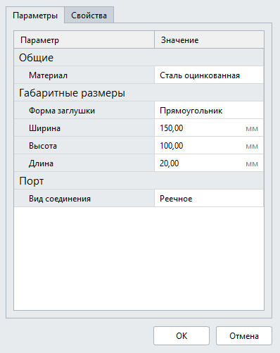
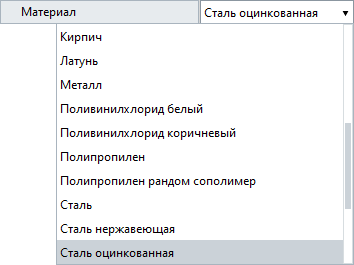
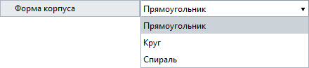
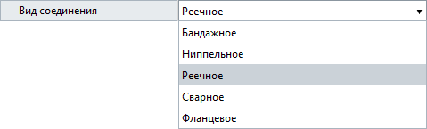
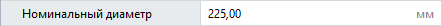
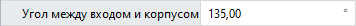
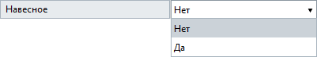

Сoздание параметров
===================

Все пользовательские параметры описываются в файле JSON.

.. note:: Для описание параметров можно пользоваться любым текстовым редактором с подсветкой синтаксиса JSON

Файл должен состоять из `объекта JSON <https://www.json.org/json-ru.html>`_ ``metadata``, массивов ``styleParameters`` и ``ports``:

.. code-block::
    :linenos:

    {
        "metadata" : {..},
        "styleParameters" : [..],
        "ports" : [..]
    }

Метаданные
----------

В объекте ``metadata`` описывается общая информация о категории оборудования (отображается в диалоге "Категории", но не в самом стиле объекта Renga).

.. code-block::
    :linenos:

    {
        "metadata" : {
            "defaultName" : "Название оборудования",
            "description" : "Описание",
            "version" : "1.0.0",
            "author" : "Иванов Иван Иванович"
        },
        ..
    }

Параметры стиля
---------------

Массив ``styleParameters`` — это упорядоченная коллекция групп параметров, которые будут представлены в диалоге стиля объекта. Каждая группа параметров — это объект JSON со своими атрибутами. В массиве ``params`` перечисляются параметры, входящие в эту группу.

.. code-block::
    :linenos:

    {
        ..
        "styleParameters" : [
            {
                "name" : "General",
                "text" : "Общие",
                "params" : [..]
            },
            {
                "name" : "Dimensions",
                "text" : "Габаритные размеры",
                "params" : [..]
            },
            ..
        ],
        ..
    }

.. admonition:: Соглашение об описании параметров

    Для унификации отображения параметров в диалоге стиля объекта принято группу "Общие" делать первой в списке, второй — группу "Габаритные размеры", а затем указывать группы "Порты" или "Точки подключения".

Пример:

Для любого параметра обязательным является атрибут ``name``. Он является ключом для получения значения этого параметра в скриптах. См. следующую главу :doc:`Назначение параметров <../assignparams>`

Типы параметров диалога стиля объекта
-------------------------------------

Параметры можно создавать различных типов. В зависимости от используемого типа они по-разному отображаются во вкладке "Параметры" диалога стиля объекта.

.. _id_param:

ID
""
Используется для указания материала объекта. Задается с помощью следующих атрибутов:

* ``name`` — имя параметра,
* ``text`` — отображаемое имя параметра в диалоге стиля Renga,
* ``type`` — тип параметра,
* ``entityTypeId`` — указывает на уникальный идентификатор системного типа Renga — Материал. См. `Справку по API Renga <https://help.rengabim.com/api/group___style_type_ids.html>`_.

.. admonition:: Соглашение об описании параметров

    Параметр "Материал" указывается в группе "Общие"

.. code-block::
    :caption: Пример 1. Описание параметра ``material``
    :linenos:

    {
        "name" : "material",
        "text" : "Материал",
        "type" : "Id",
        "entityTypeId" : "0abcb18f-0aaf-4509-bf89-5c5fad9d5d8b"
    }

Данный параметр отображается в виде раскрывающегося списка (Combobox) для выбора пользователем нужного материала.

.. _userenum:

UserEnum
""""""""

Указывается при задании возможных вариантов исполнения объекта.

Для задания параметра типа UserEnum используются следующие атрибуты:

* ``name`` — имя параметра,
* ``text`` — отображаемое имя параметра в диалоге стиля Renga,
* ``type`` — тип параметра,
* ``default`` — значение по-умолчанию,
* ``items`` — список вариантов.

.. code-block::
    :caption: Пример 2. Описание параметра ``bodyShape``
    :linenos:

    {
        "name" : "bodyShape",
        "text" : "Форма корпуса",
        "type" : "UserEnum",
        "default" : "volute",
        "items" : [
            {
                "key" : "rectangle",
                "text" : "Прямоугольник"            
            },
            {
                "key" : "circle",
                "text" : "Круг"            
            },
            {
                "key" : "volute",
                "text" : "Спираль"            
            }
        ]
    }

Данный параметр отображается в виде раскрывающегося списка (Combobox) для выбора пользователем нужного значения.

.. _coreenum:

CoreEnum
""""""""

Параметры типа CoreEnum используются для указания:

- Вида соединения точек подключения (для трубопроводного оборудования :ref:`PipeConnectorType <pipe_type>`, для вентиляционного оборудования :ref:`AirConnectorType <air_type>`)
- Диаметра резьбы (в случае резьбового соединения труб :ref:`PipeThreadSize <thread_size>`)

Для определения таких параметров используются следующие атрибуты:

* ``name`` — имя параметра
* ``text`` — отображаемое имя параметра в диалоге стиля Renga
* ``type`` — тип параметра
* ``coreEnumType`` — :doc:`идентификатор системных перечислений <../coreenums>`
* ``default`` — значение по-умолчанию

.. code-block::
    :caption: Пример 3. Описание параметра ``connectorType``
    :linenos:

    {
        "name" : "connectorType",
        "text" : "Вид соединения",
        "type" : "CoreEnum",
        "coreEnumType" : "AirConnectorType",
        "default" : "DriveSlip"
    }

Данный параметр отображается в виде раскрывающегося списка (Combobox) для выбора пользователем нужного значения.

.. _length_param:

Length
""""""

Используется для любого метрического параметра (длина, ширина, диаметр,..) для указания пользовательского значения.

Для задания параметра типа Length используются следующие атрибуты:

* ``name`` — имя параметра
* ``text`` — отображаемое имя параметра в диалоге стиля Renga
* ``type`` — тип параметра
* ``default`` — значение по-умолчанию
* ``min`` — минимально возможное значение
* ``max`` — максимально возможное значение

.. code-block::
    :caption: Пример 4. Описание параметра ``nominalDiameter``
    :linenos:

    {
        "name" : "nominalDiameter",
        "text" : "Номинальный диаметр",
        "type" : "Length",
        "default" : 225,
        "min" : 10,
        "max" : 1000000
    }

Данный параметр отображается в виде поля для ввода пользователем нужного значения.

Если пользователь захочет ввести значение, которое находится вне диапазона, установленного атрибутами ``min`` и ``max``, то Renga просигнализирует о недопустимом значении красной рамкой в поле ввода и не примет его:

.. image:: _static/invalid_input.png
    :align: center

Angle
"""""

Используется для параметра, указывающего значение угла в градусах.

Для задания параметра типа Angle используются следующие атрибуты:

* ``name`` — имя параметра
* ``text`` — отображаемое имя параметра в диалоге стиля Renga
* ``type`` — тип параметра
* ``default`` — значение по-умолчанию
* ``min`` — минимально возможное значение
* ``max`` — максимально возможное значение

.. code-block::
    :caption: Пример 5. Описание параметра ``angleBetweenInletAndBody``
    :linenos:

    {
        "name" : "angleBetweenInletAndBody",
        "text" : "Угол между входом и корпусом",
        "type" : "Angle",
        "default" : 135,
        "min" : 0,
        "max" : 180
    }

Данный параметр отображается в виде поля для ввода пользователем нужного значения.

Boolean
"""""""

Параметр, принимающий только два значения — Да/Нет.

Для задания параметра типа Boolean используются следующие атрибуты:

* ``name`` — имя параметра
* ``text`` — отображаемое имя параметра в диалоге стиля Renga
* ``type`` — тип параметра
* ``default`` — значение по-умолчанию

.. code-block::
    :caption: Пример 5. Описание параметра ``isMounted``
    :linenos:

    {
        "name" : "isMounted",
        "text" : "Навесное",
        "type" : "Boolean",
        "default" : false
    }

Данный параметр отображается в виде раскрывающегося списка (Combobox) для выбора пользователем нужного значения.

Real и Integer
""""""""""""""

Параметры для указания числового значения. Real — действительное число (с дробной частью), Integer — целое число.

Для задания параметров типа Real или Integer используются следующие атрибуты:

* ``name`` — имя параметра
* ``text`` — отображаемое имя параметра в диалоге стиля Renga
* ``type`` — тип параметра
* ``default`` — значение по-умолчанию
* ``min`` — минимально возможное значение
* ``max`` — максимально возможное значение

Данные параметры отображаются в виде поля для ввода пользователем нужного значения.

String
""""""

Параметры для указания строкового значения (текста).

Для задания параметра типа String используются следующие атрибуты:

* ``name`` — имя параметра
* ``text`` — отображаемое имя параметра в диалоге стиля Renga
* ``type`` — тип параметра
* ``default`` — значение по-умолчанию

Данный параметр отображается в виде поля для ввода пользователем нужного значения.

Параметры точек подключения
---------------------------

Массив ``ports`` содержит описание точек подключения (портов) оборудования. Каждое описание порта представляет собой объект JSON, в качестве имени ``name`` которого указывается имя порта. Количество объектов JSON равно количеству портов. В портах перечисляются категории инженерных систем, к которым будет подключаться оборудование и их параметры.

``flowDirection`` — направление потока. Указывается идентификатор согласно таблице:

.. _flow:

+-------------------+----------------+
| идентификатор     | описание       |
+===================+================+
| Inlet             | вход           |
+-------------------+----------------+
| Outlet            | выход          |
+-------------------+----------------+
| InletAndOutlet    | неопределенный |
+-------------------+----------------+

.. attention:: Если в JSON не указан атрибут ``flowDirection``, то направление потока в порту будет иметь значение ``InletAndOutlet``

``systemCategories`` представляет собой массив идентификаторов категорий систем (:ref:`трубопроводных <p_system>`, :ref:`воздуховодных <d_system>` или :ref:`электрических <e_system>`), к которым можно будет подключать оборудование в выбранной категории. 

.. code-block::
    :caption: Пример 5. Описание портов оборудования.
    :linenos:

    {
        ..
        "ports" : [
            {
                "name" : "coldWater",
                "text" : "Бытовое холодное водоснабжение",
                "flowDirection" : "Inlet"
                "systemCategories" : [
                    "DomesticColdWater"
                ]
            },
            {
                "name" : "hotWater",
                "text" : "Бытовое горячее водоснабжение",
                "flowDirection" : "Inlet"
                "systemCategories" : [
                    "DomesticHotWater"
                 ]
            },
            {
                "name" : "sewage",
                "text" : "Канализация",
                "flowDirection" : "Outlet"
                "systemCategories" : [
                    "DomesticSewage",
                    "IndustrialSewage"
                ]
            },
            ..
        ]
    }

.. _p_system:

Идентификаторы категорий систем
-------------------------------

.. admonition:: Соглашение о наименовании

    Все идентификаторы пишутся в `PascalCase <https://ru.wikipedia.org/w/index.php?title=PascalCase&redirect=no>`_

* **Категории трубопроводных систем**

+------------------------+-----------------------------------------+
| идентификатор          | описание                                |
+========================+=========================================+
| DomesticColdWater      | бытовое холодное водоснабжение          |
+------------------------+-----------------------------------------+
| DomesticHotWater       | бытовое горячее водоснабжение           |
+------------------------+-----------------------------------------+
| DomesticSewage         | бытовая канализация                     |
+------------------------+-----------------------------------------+
| Gas                    | бытовое газоснабжение                   |
+------------------------+-----------------------------------------+
| Firewater              | водяное пожаротушение                   |
+------------------------+-----------------------------------------+
| Heating                | водяное теплоснабжение                  |
+------------------------+-----------------------------------------+
| GaseousFireSuppression | газовое пожаротушение                   |
+------------------------+-----------------------------------------+
| Rainwater              | дождевая канализация                    |
+------------------------+-----------------------------------------+
| IndustrialColdWater    | производственное холодное водоснабжение |
+------------------------+-----------------------------------------+
| IndustrialHotWater     | производственное горячее водоснабжение  |
+------------------------+-----------------------------------------+
| IndustrialSewage       | производственная канализация            |
+------------------------+-----------------------------------------+
| OtherPipeSystem        | прочие трубопроводные системы           |
+------------------------+-----------------------------------------+

.. _d_system:

* **Категории воздуховодных систем**

+-----------------+------------------------------+
| идентификатор   | описание                     |
+=================+==============================+
| Ventilation     | приточная вентиляция         |
+-----------------+------------------------------+
| Exhaust         | вытяжная вентиляция          |
+-----------------+------------------------------+
| Pressurization  | приточное дымоудаление       |
+-----------------+------------------------------+
| SmokeExhaust    | вытяжное дымоудаление        |
+-----------------+------------------------------+
| Vacuum          | пылеудаление                 |
+-----------------+------------------------------+
| OtherDuctSystem | прочие воздуховодные системы |
+-----------------+------------------------------+

.. _e_system:

* **Категории электрических систем**

+-----------------------+------------------------------+
| идентификатор         | описание                     |
+=======================+==============================+
| LightingCircuit       | осветительная сеть           |
+-----------------------+------------------------------+
| PowerCircuit          | силовая сеть                 |
+-----------------------+------------------------------+
| OtherElectricalSystem | прочие электрические системы |
+-----------------------+------------------------------+