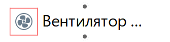

Введение
========

Renga расширяет свои внутренние возможности по созданию пользовательских категорий инженерного оборудования благодаря cкриптам, написанным на языке LUA.

Окружение
---------

Для описания пользовательской категории оборудования необходимо подготовить следующие файлы:

1. Файл ``parameters.json`` — для описания параметров оборудования.

Созданию параметров и использованию их в скриптах посвящена первая часть руководства :doc:`Параметризация <../createparams>`

2. Файл ``main.lua`` — непосредственно скриптовая часть, в которой описываются функции на языке LUA, для создания различного отображения оборудования в Renga (детальное, условное, символьное), а также его порты.

Обзору встроенных функций посвящена вторая часть руководства :doc:`Обзор функций <../packages>`

.. note:: Для написания скриптов рекомендуется руководствоваться специализированными справочниками, например, `Programming in LUA <https://www.lua.org/pil/contents.html>`_

3. Файл ``graph_icon.svg`` — условное изображение категории оборудования в графе во вкладке соответствующей системы (см. `Справку Renga <https://help.rengabim.com/ru/index.htm#MEP_design.htm>`_). Пример:|pic1| 

.. note:: Размер иконки должен быть равен 24х24 пикселя.

Подготовленные три файла должны быть скомпилированы в один, с расширением .rtc (**Renga Template Category** - шаблон категории Renga).

Шаблон категории Renga
----------------------

Добавление нового шаблона категории пользовательского оборудования в Renga осуществляется из меню "**Управление стилями**" — "**Категории**".