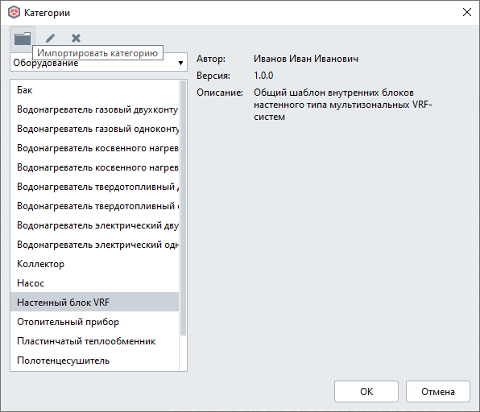
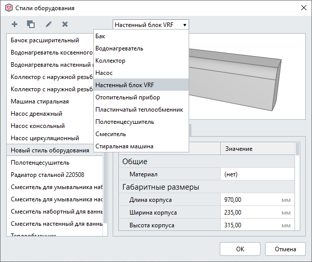

Введение
========

`Renga <https://rengabim.com/>`_ расширяет свои внутренние возможности по созданию пользовательских шаблонов стилей инженерного оборудования благодаря пользовательским cкриптам, написанным на языке **Renga STDL**.

**STDL** (**Style Template Description Language** , *язык описания шаблона стиля*) — предметно-ориентированный язык на основе Lua, который предоставляет средства для описания шаблонов стиля с использованием встроенных возможностей Lua (условия, циклы и т.д.), набора функций для взаимодействия с Renga **Style Template API** (создание и редактирование геометрии объекта с помощью пользовательских параметров, создание портов оборудования, управления отображением параметров в диалоге стиля).

Окружение
---------

Описание шаблона стиля оборудования состоит из нескольких файлов:

1. Файл описания параметров оборудования в формате JSON.

Созданию параметров и использованию их в скриптах посвящена первая часть руководства :doc:`Параметризация <../createparams>`

2. Один или несколько файлов скриптов на языке Lua. В скриптах описываются функции, которые будут создавать различное отображения оборудования в Renga (детальный, условный, символьный уровень детализации) на основе параметров стиля, управлять отображением параметров в стиле оборудования, а также размещать его порты и задавать им параметры.

Обзору функций для взаимодействия с Renga **Style Template API** посвящена вторая часть руководства :doc:`Обзор функций <../packages>`

.. note:: При написании скриптов рекомендуется руководствоваться специализированными справочниками, например, `Programming in Lua <http://www.lua.org/manual/5.4/>`_, а также официальной документацией по Renga STDL

.. 3. Файл ``graph_icon.svg`` — условное изображение категории оборудования во вкладке соответствующей системы (см. `Справку Renga <https://help.rengabim.com/ru/index.htm#MEP_design.htm>`_). Пример:|pic1| 

    .. |pic1| image:: _static/graph_icon.png
        :scale: 50%

Перед импортом в Renga подготовленные файлы должны быть собраны в один файл с расширением **RST** (**Renga Style Template**, *шаблон стиля Renga*). Сборка осуществляется с помощью утилиты **RstBuilder.exe**, которая входит в комплект разработчика `Renga STDL SDK <https://dl.rengabim.com/STDLSDK/RengaSTDLSDK.zip>`_.

.. important:: Подробно описано в главе `Сборка шаблона стиля <https://help.rengabim.com/stdl/ru/md__pages__ru_4_template_builder.html>`_ справочного руководства Renga STDL.

Шаблон стиля Renga
------------------

Шаблон стиля в Renga формирует новую **категорию**, на основе которой можно создавать свои стили оборудования.

Импорт нового шаблона стиля оборудования в Renga осуществляется из меню "Управление стилями" — "Категории".

В дальней работе проектировщик сможет самостоятельно создавать свои стили на основе новой категории.

