Твердотельная 3D-геометрия (класс Solid)
========================================

Общий класс **Solid** не имеет конструктора. Содержит функции, порождающие твердотельную геометрию. Служит для построения 3D-геометрии объектов.

Порождающие функции
-------------------

Параллелепипед
^^^^^^^^^^^^^^

Четырехугольная призма, все грани которой являются прямоугольниками (прямоугольный параллелепипед).
    
.. lua:function:: CreateBlock(length, width, height, placement)

    :param length: Задает длину параллелепипеда.
    :type length: Number
    :param width: Задает глубину параллелепипеда.
    :type width: Number
    :param height: Задает высоту параллелепипеда.
    :type height: Number
    :param placement: (optional) Задает локальную систему координат, в которой строится тело. Если не задана, то для построения используется глобальная система координат.
    :type placement: :ref:`Placement3D <placement3d>`
    :return: Твердотельная 3D-геометрия.
    :rtype: Solid

.. code-block:: lua
    :caption: Пример 1. Создание куба.
    :linenos:

    local detailedGeometry = ModelGeometry()
    local cubeSolid = CreateBlock(20, 20, 20)
    detailedGeometry:AddSolid(cubeSolid)
    Style.SetDetailedGeometry(detailedGeometry)

Результат:

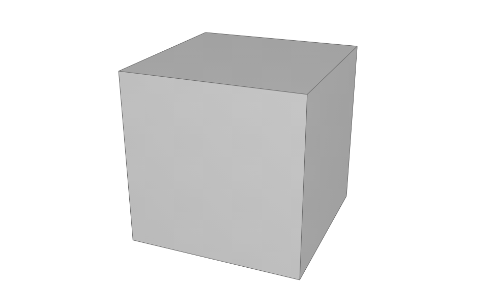

.. code-block:: lua
    :caption: Пример 2. Создание параллелепипеда.
    :linenos:

    local detailedGeometry = ModelGeometry()
    local boxSolid = CreateBlock(40, 15, 20)
    detailedGeometry:AddSolid(boxSolid)
    Style.SetDetailedGeometry(detailedGeometry)

Результат:

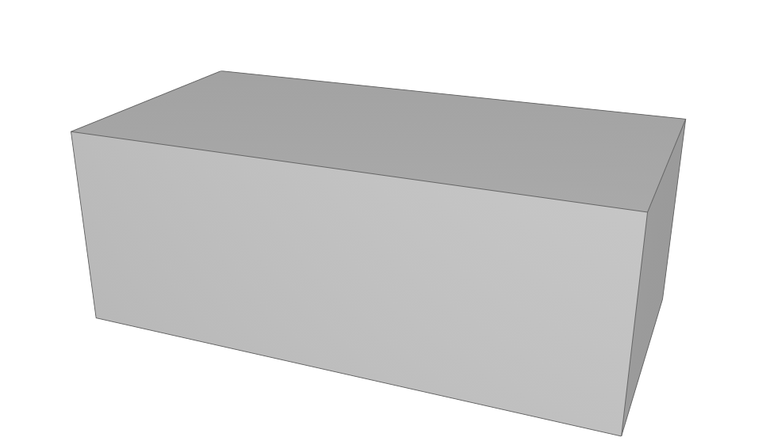

Сфера
^^^^^

.. lua:function:: CreateSphere(radius, originPoint)

    :param radius: Задает радиус сферы.
    :type radius: Number
    :param originPoint: (optional) Задает точку центра сферы. Если не задана, соответствует началу координат.
    :type originPoint: :ref:`Point3D <point3d>`
    :return: Твердотельная 3D-геометрия.
    :rtype: Solid

.. code-block:: lua
    :caption: Пример 3.
    :linenos:

    local detailedGeometry = ModelGeometry()
    local bearingSolid = CreateSphere(10)
    detailedGeometry:AddSolid(bearingSolid:ShowTangentEdges(false))
    Style.SetDetailedGeometry(detailedGeometry)

Результат:

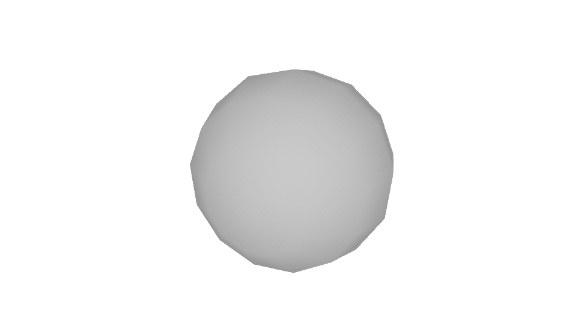

Правильный круговой цилиндр
^^^^^^^^^^^^^^^^^^^^^^^^^^^

Тело, ограниченное цилиндрической поверхностью и двумя параллельными плоскостями, пересекающими её.

.. lua:function:: CreateRightCircularCylinder(radius, height, placement)

    :param radius: Задает радиус цилиндра.
    :type radius: Number
    :param height: Задает высоту цилиндра.
    :type height: Number
    :param placement: (optional) Задает локальную систему координат, в которой строится тело. Если не задана, то для построения используется глобальная система координат.
    :type placement: :ref:`Placement3D <placement3d>`
    :return: Твердотельная 3D-геометрия.
    :rtype: Solid

.. code-block:: lua
    :caption: Пример 4.
    :linenos:

    local detailedGeometry = ModelGeometry()
    local pinSolid = CreateRightCircularCylinder(10, 40)
    detailedGeometry:AddSolid(pinSolid:ShowTangentEdges(false))
    Style.SetDetailedGeometry(detailedGeometry)

Результат:

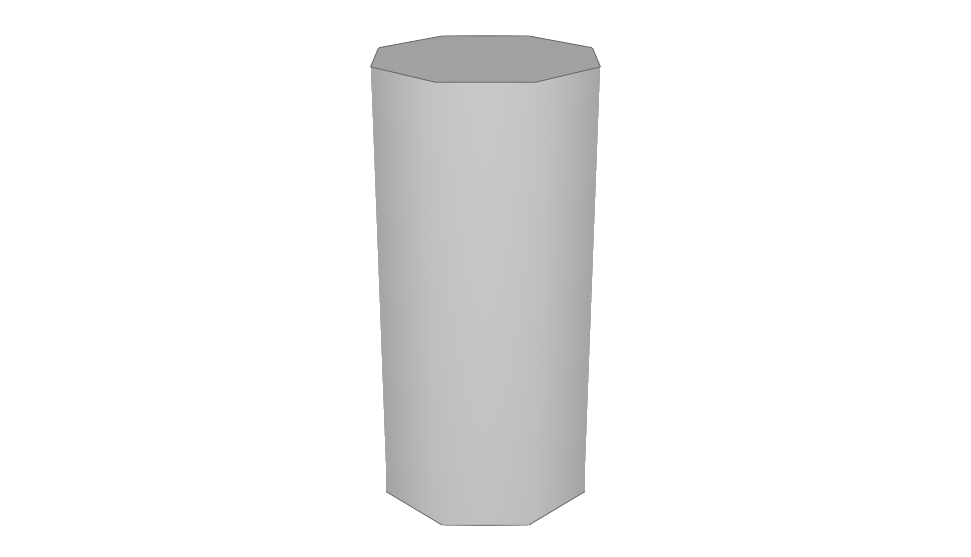

Правильный эллиптический цилиндр
^^^^^^^^^^^^^^^^^^^^^^^^^^^^^^^^

.. lua:function:: CreateRightEllipticalCylinder(halfRadiusX, halfRadiusY, height, placement)

    :param halfRadiusX: Задает радиус полуоси вдоль оси X.
    :type halfRadiusX: Number
    :param halfRadiusY: Задает радиус полуоси вдоль оси Y.
    :type halfRadiusY: Number
    :param height: Задает высоту цилиндра по оси Y.
    :type height: Number
    :param placement: (optional) Задает локальную систему координат, в которой строится тело. Если не задана, то для построения используется глобальная система координат.
    :type placement: :ref:`Placement3D <placement3d>`
    :return: Твердотельная 3D-геометрия.
    :rtype: Solid    

Правильный круговой конус
^^^^^^^^^^^^^^^^^^^^^^^^^

Прямой конус, основанием которого является окружность и ортогональная проекция вершины конуса на плоскость основания совпадает с этим центром.

.. lua:function:: CreateRightCircularCone(radius, height, placement)

    :param radius: Задает радиус конуса.
    :type radius: Number
    :param height: Задает высоту конуса.
    :type height: Number
    :param placement: (optional) Задает локальную систему координат, в которой строится тело. Если не задана, то для построения используется глобальная система координат.
    :type placement: :ref:`Placement3D <placement3d>`
    :return: Твердотельная 3D-геометрия.
    :rtype: Solid

.. code-block:: lua
    :caption: Пример 5.
    :linenos:

    local detailedGeometry = ModelGeometry()
    local coneSolid = CreateRightCircularCone(10, 40)
    detailedGeometry:AddSolid(coneSolid:ShowTangentEdges(false))
    Style.SetDetailedGeometry(detailedGeometry)

Результат:

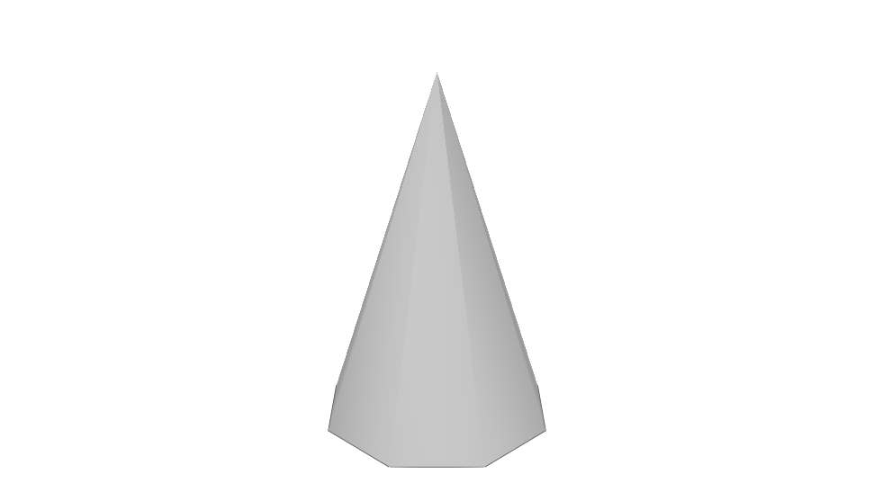

Правильная призма
^^^^^^^^^^^^^^^^^

Основанием является многоугольник, заданый массивом точек-вершин. Боковые грани — прямоугольники.

.. lua:function:: CreateRightPrism({points}, height, placement)

    :param points: Задает таблицу точек, определяющих ребра многоугольника - основания призмы.
    :type points: table of :ref:`Points2D<point2d>` 
    :param height: Задает высоту призмы.
    :param placement: (optional) Задает локальную систему координат, в которой строится тело. Если не задана, то для построения используется глобальная система координат.
    :type placement: :ref:`Placement3D <placement3d>`
    :type height: Number
    :return: Твердотельная 3D-геометрия.
    :rtype: Solid

Пирамида с прямоугольным основанием
^^^^^^^^^^^^^^^^^^^^^^^^^^^^^^^^^^^

Основанием пирамиды является прямоугольник.

.. lua:function:: CreateRectangularPyramid(width, depth, height, placement)

    :param width: Задает размер основания пирамиды по оси X.
    :type width: Number
    :param depth: Задает размер основания пирамиды по оси Y.
    :type depth: Number    
    :param height: Задает высоту пирамиды.
    :type height: Number
    :param placement: (optional) Задает локальную систему координат, в которой строится тело. Если не задана, то для построения используется глобальная система координат.
    :type placement: :ref:`Placement3D <placement3d>`
    :return: Твердотельная 3D-геометрия.
    :rtype: Solid

.. code-block:: lua
    :caption: Пример 6.
    :linenos:

    local detailedGeometry = ModelGeometry()
    local baseSolid = CreateRectangularPyramid(25, 15, 20)
    detailedGeometry:AddSolid(baseSolid)
    Style.SetDetailedGeometry(detailedGeometry)

Результат:

.. image:: _static/Pyramid.png
    :height: 230 px
    :width: 400 px
    :align: center

.. _extrusion:

Тело перемещения диска по пути
^^^^^^^^^^^^^^^^^^^^^^^^^^^^^^

Строится путем перемещения круглого диска по трехмерной кривой.

.. lua:function:: CreateSweptDiskSolid(radius, holeRadius, guideCurve)

    :param radius: Задает радиус круглого диска для перемещения по пути.
    :type radius: Number
    :param holeRadius: Задает радиус круглого отверстия в центре диска.
    :type holeRadius: Number
    :param guideCurve: Задает направляющую трёхмерную кривую.
    :type guideCurve: :ref:`Curve3D <curve3d>`
    :return: Твердотельная 3D-геометрия.
    :rtype: Solid

Тело выдавливания
^^^^^^^^^^^^^^^^^

.. lua:function:: Extrude(contour, extrusionParameters, placement)

    :param contour: Задает плоский контур выдавливания.
    :type contour: :ref:`Curve2D <curve2d>`   
    :param extrusionParameters: Задает дополнительные параметры построения.
    :type extrusionParameters: :ref:`ExtrusionParameters <extrusion_params>`
    :param placement: (optional) Задает локальную систему координат, в которой строится тело. Если не задана, то для построения используется глобальная система координат.
    :type placement: :ref:`Placement3D <placement3d>`
    :return: Твердотельная 3D-геометрия.
    :rtype: Solid

    .. _extrusion_params:

    Дополнительные параметры построения для функции Extrude
    """""""""""""""""""""""""""""""""""""""""""""""""""""""
    
    .. lua:function:: ExtrusionParameters(ForwardDirectionDepth, ReverseDirectionDepth)

        :param ForwardDirectionDepth: Задает глубину выдавливания в прямом направлении.
        :type ForwardDirectionDepth: Number
        :param ReverseDirectionDepth: (optional) Задает глубину выдавливания в обратном направлении. Значение по умолчанию равно 0.
        :type ReverseDirectionDepth: Number

        :MEMBERS:

            * **OutwardOffset** (``Number``) - Задает отступ наружу от образующей кривой. Значение по умолчанию равно 0.
            * **InwardOffset** (``Number``) - Задает отступ внутрь от образующей кривой. Значение по умолчанию равно 0.

            .. note:: Используются для построения тонкостенного тела. При ``OutwardOffset`` = 0 и ``InwardOffset`` = 0 строится сплошное тело по контуру.

            * **ForwardDirectionDraftAngle** (``Number``) - Задает угол наклона при выдавливании в прямом направлении в радианах. Значение по умолчанию равно 0.
            * **ReverseDirectionDraftAngle** (``Number``) - Задает угол наклона при выдавливании в обратном направлении в радианах. Значение по умолчанию равно 0.

            .. note:: При положительном значении происходит сужение. При отрицательном - расширение. Используются только при выдавливании по направлению вдоль оси Z.

            * **Direction** (:ref:`Vector3D <vector3d>`) - Задает направление выдавливания. По умолчанию равно направлению оси Z.
        
.. code-block:: lua
    :caption: Пример 7. Построение полнотелого тела, путем задания контура и направления выдавливания - вертикально вверх.
    :linenos:

    local detailedGeometry = ModelGeometry()
    local points = {Point2D(0, 0),
                    Point2D(0, 10),
                    Point2D(10, 10),
                    Point2D(10, 8),
                    Point2D(8, 8),
                    Point2D(8, 6),
                    Point2D(6, 6),
                    Point2D(6, 4),
                    Point2D(4, 4),
                    Point2D(4, 2),
                    Point2D(2, 2),
                    Point2D(2, 0),
                    Point2D(0, 0)}
    local extrusionContour = CreatePolyline2D(points)
    -- глубина выдавливания в прямом направлении = 40, в обратном направлении - по умолчанию = 0:
    local params = ExtrusionParameters(40)
    -- значения дополнительным атрибутам ExtrusionParameters() не задаем, значения принимаются по умолчанию
    local moldingSolid = Extrude(extrusionContour,
                                 params)
    detailedGeometry:AddSolid(moldingSolid)
    Style.SetDetailedGeometry(detailedGeometry)

Результат:

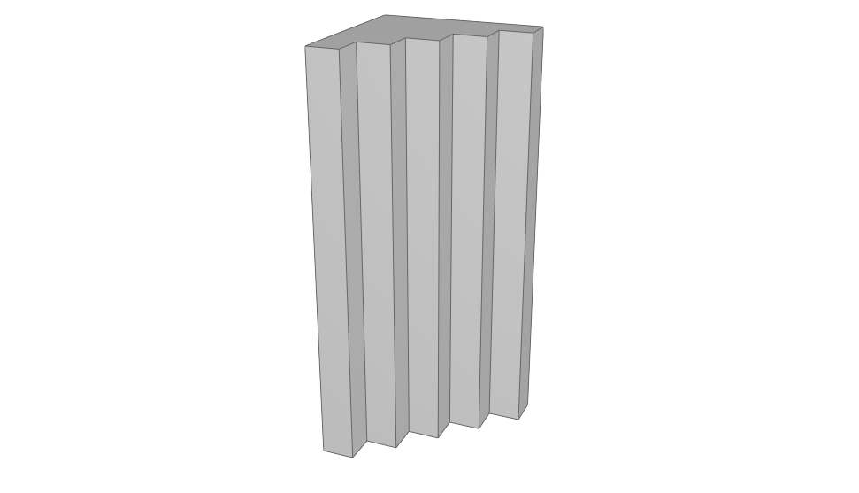

.. code-block:: lua
    :caption: Пример 8. Построение тонкостенного тела, путем задания контура и направления выдавливания - вертикально вверх.
    :linenos:

    local detailedGeometry = ModelGeometry()
    local points = {Point2D(0, 0),
                    Point2D(0, 10),
                    Point2D(10, 10),
                    Point2D(10, 8),
                    Point2D(8, 8),
                    Point2D(8, 6),
                    Point2D(6, 6),
                    Point2D(6, 4),
                    Point2D(4, 4),
                    Point2D(4, 2),
                    Point2D(2, 2),
                    Point2D(2, 0),
                    Point2D(0, 0)}
    local profileContour = CreatePolyline2D(points)
    -- глубина выдавливания в прямом направлении = 15, в обратном направлении - по умолчанию = 0:
    local params = ExtrusionParameters(15)
    -- толщина отступа наружу и внутрь относительно заданного контура = 0.5:
    params.OutwardOffset = params.InwardOffset = 0.5
    local thinSolid = Extrude(profileContour,
                              params)
    detailedGeometry:AddSolid(thinSolid)
    Style.SetDetailedGeometry(detailedGeometry)

Результат:

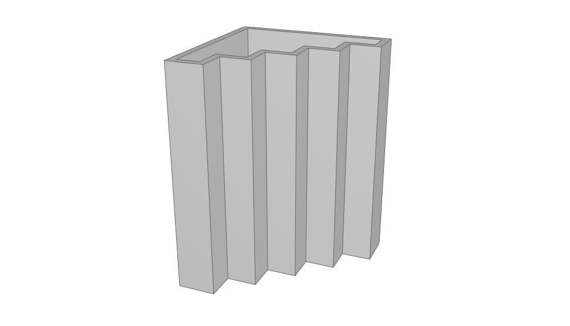

Построение тела по плоским сечениям
^^^^^^^^^^^^^^^^^^^^^^^^^^^^^^^^^^^

Размер массива ``profiles`` должен быть равен размеру массива ``placements``.

.. lua:function:: Loft({profiles}, {placements}, loftParameters)

    :param {profiles}: Задает таблицу плоских контуров.
    :type {profiles}: table of :ref:`Curves2D <curve2d>`   
    :param {placements}: Задает таблицу координатных плоскостей в 3D пространстве.
    :type {placements}: table of :ref:`Placements3D <placement3d>`
    :param loftParameters: (optional) Задает дополнительные параметры построения.
    :type loftParameters: :ref:`LoftParameters <loft_params>`
    :return: Твердотельная 3D-геометрия.
    :rtype: Solid

    .. _loft_params:

    Дополнительные параметры построения для функции Loft
    """"""""""""""""""""""""""""""""""""""""""""""""""""
    
    .. lua:function:: LoftParameters()

        :MEMBERS:

            * **OutwardOffset** (``Number``) - Задает отступ наружу от образующей кривой. Значение по умолчанию равно 0.
            * **InwardOffset** (``Number``) - Задает отступ внутрь от образующей кривой. Значение по умолчанию равно 0.

            .. note:: Используются для построения тонкостенного тела. При ``OutwardOffset`` = 0 и ``InwardOffset`` = 0 строится сплошное тело по контуру.

            * **GuideCurve** (:ref:`Curve3D <curve3d>`) - (optional) Задает направляющую кривую. Если не задана, то соединение кривых будет осуществлено по кратчайшему пути.
            * **ControlPoints** (table of :ref:`Points3D <point3d>`) - (optional) Задает контрольные точки. Если список точек не пустой, то он должен быть согласован со списком кривых сечений ``profiles`` и систем координат ``placements``.

            .. note:: С помощью контрольных точек управляется положение ребер, соединяющих вершины разных контуров множества ``profiles``.

.. code-block:: lua
    :caption: Пример 9.
    :linenos:

    local detailedGeometry = ModelGeometry()
    local profiles = {
        CreateRectangle2D(Point2D(0, 0), 0, 30, 30),
        CreateCircle2D(Point2D(0, 0), 10)}
    local placements = {
        Placement3D(Point3D(0, 0, 0),
                    Vector3D(1, 0, 0),
                    Vector3D(0, 1, 0)),
        Placement3D(Point3D(40, 0, 0),
                    Vector3D(1, 0, 0),
                    Vector3D(0, 1, 0))}
    -- дополнительные параметры LoftParameters() не указаны, соединение контуров будет выполнятся по кратчайшему пути
    local loftedSolid = Loft(profiles, placements)
    detailedGeometry:AddSolid(loftedSolid)
    Style.SetDetailedGeometry(detailedGeometry)

Результат:

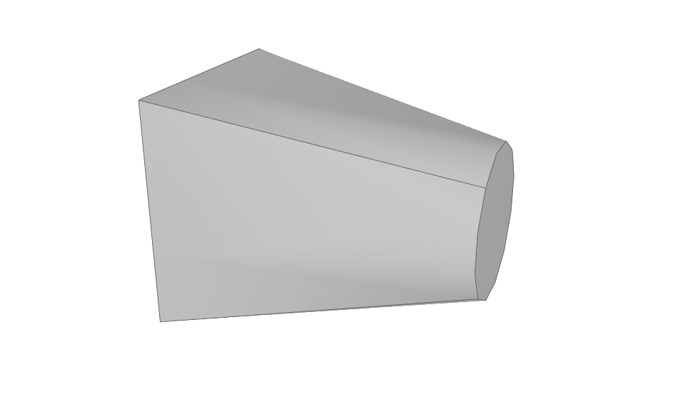

.. code-block:: lua
    :caption: Пример 10.
    :linenos:

    local detailedGeometry = ModelGeometry()
    local profiles = {
        CreateRectangle2D(Point2D(0, 0), 0, 30, 30),
        CreateCircle2D(Point2D(0, 0), 10)}
    local placements = {
        Placement3D(Point3D(0, 0, 0),
                    Vector3D(1, 0, 0),
                    Vector3D(0, 1, 0)),
        Placement3D(Point3D(30, 0, 30),
                    Vector3D(0, 0, 1),
                    Vector3D(1, 0, 0))}
    -- создаем направляющую кривую
    local guideArc3D = CreateArc3DByCenterStartEndPoints(Point3D(0, 0, 30),
                                                        Point3D(0, 0, 0),
                                                        Point3D(30, 0, 30),
                                                        false)
    -- указываем направляющую кривую в дополнительных параметрах LoftParameters()
    local loftParams = LoftParameters()
    loftParams.GuideCurve = guideArc3D
    local loftedSolid = Loft(profiles, placements, loftParams)
    detailedGeometry:AddSolid(loftedSolid)
    Style.SetDetailedGeometry(detailedGeometry)

Результат:

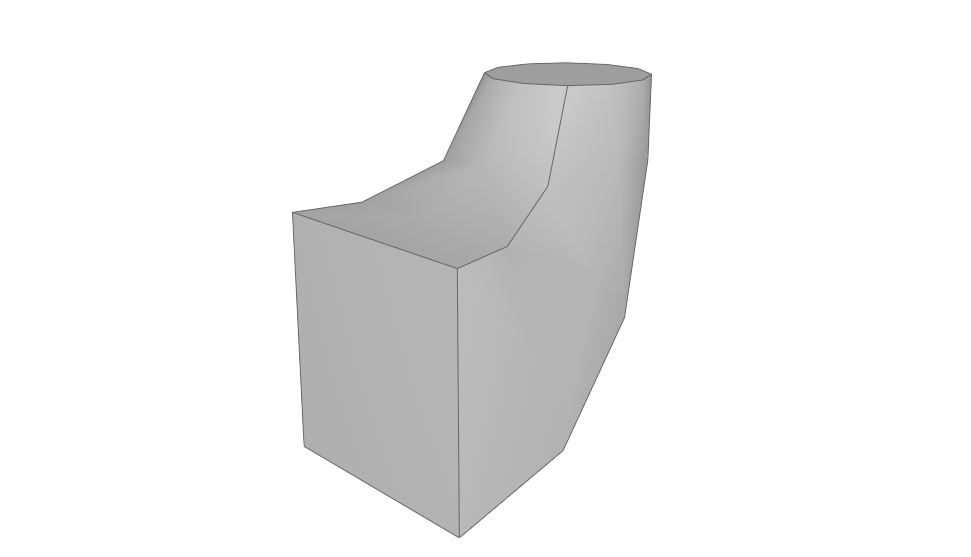

Тело вращения
^^^^^^^^^^^^^

Вращение плоского замкнутого контура вокруг заданной оси на указанный угол.

.. lua:function:: Revolve(contour, placement, axis, revolutionParameters)

    :param contour: Задает плоский контур.
    :type contour: :ref:`Curve2D <curve2d>`
    :param placement: Задает координатную плоскость.
    :type placement: :ref:`Placement3D <placement3d>`
    :param axis: Задает ось вращения.
    :type axis: :ref:`Axis3D <axis3d>`
    :param revolutionParameters: Задает дополнительные параметры построения.
    :type revolutionParameters: :ref:`RevolutionParameters <revolve_params>`
    :return: Твердотельная 3D-геометрия.
    :rtype: Solid

    .. _revolve_params:

    Дополнительные параметры построения для функции Revolve
    """""""""""""""""""""""""""""""""""""""""""""""""""""""
    
    .. lua:function:: RevolutionParameters(counterClockwiseAngle)

        :param counterClockwiseAngle: Задает угол вращения против часовой стрелки в радианах.
        :type counterClockwiseAngle: Number
    
        :MEMBERS:

            * **OutwardOffset** (``Number``) - Задает отступ наружу от образующей кривой. Значение по умолчанию равно 0.
            * **InwardOffset** (``Number``) - Задает отступ внутрь от образующей кривой. Значение по умолчанию равно 0.

            .. note:: Используются для построения тонкостенного тела. При ``OutwardOffset`` = 0 и ``InwardOffset`` = 0 строится сплошное тело по контуру.

            * **CounterClockwiseRotationAngle** (``Number``) - Задает угол вращения против часовой стрелки в радианах.
            * **ClockwiseRotationAngle** (``Number``) - Задает угол вращения по часовой стрелке в радианах.

.. code-block:: lua
    :caption: Пример 11.
    :linenos:

    local detailedGeometry = ModelGeometry()
    local placement = Placement3D(Point3D(0, 0, 0),
                                Vector3D(1, 0, 0),
                                Vector3D(0, 1, 0))
    local contour = CreateRectangle2D(Point2D(0, 0), 0, 6, 15)
    FilletCornerAfterSegment2D(contour, 3, 3)
    FilletCornerAfterSegment2D(contour, 5, 3)
    -- дополнительные параметры построение RevolutionParameters()
    local params = RevolutionParameters(0)
    params.ClockwiseRotationAngle = math.rad(270)
    -- создание геометрии
    local revolutionSolid = Revolve(contour,
                                    placement,
                                    Axis3D(Point3D(0, 10, 0), Vector3D(0, -0.5, 1)),
                                    params)
    detailedGeometry:AddSolid(revolutionSolid:ShowTangentEdges(false))
    Style.SetDetailedGeometry(detailedGeometry)

Результат:

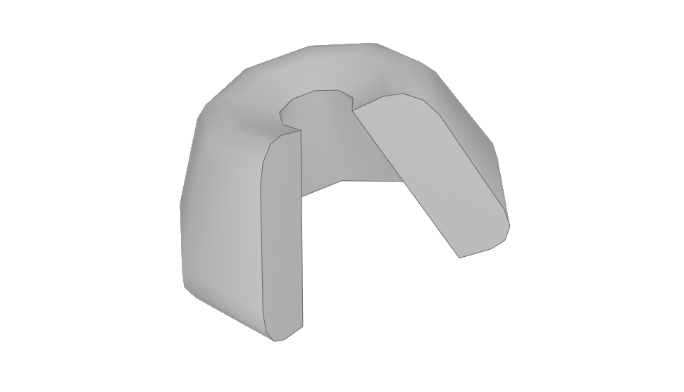

Тело заметания
^^^^^^^^^^^^^^

Построение кинематического тела путем движения образующей кривой вдоль направляющей кривой.

.. lua:function:: Evolve(profile, placement, path, evolutionParameters)

    :param profile: Задает образующую кривую.
    :type profile: :ref:`Curve2D <curve2d>`
    :param placement: Задает локальную систему координат, в плоскости XY которой располагается сечение.
    :type placement: :ref:`Placement3D <placement3d>`
    :param path: Задает направляющую кривую.
    :type path: :ref:`Curve3D <curve3d>`
    :param evolutionParameters: (optional) Задает дополнительные параметры
    :type evolutionParameters: :ref:`EvolutionParameters <evolution_params>`
    :return: Твердотельная 3D-геометрия.
    :rtype: Solid

    .. _evolution_params:

    Дополнительные параметры построения для функции Evolve
    """"""""""""""""""""""""""""""""""""""""""""""""""""""
    
    .. lua:function:: EvolutionParameters()

        :MEMBERS:

            * **OutwardOffset** (``Number``) - Задает отступ наружу от образующей кривой. Значение по умолчанию равно 0.
            * **InwardOffset** (``Number``) - Задает отступ внутрь от образующей кривой. Значение по умолчанию равно 0.

            .. note:: Используются для построения тонкостенного тела. При ``OutwardOffset`` = 0 и ``InwardOffset`` = 0 строится сплошное тело по контуру.

Методы класса
-------------

Общие методы твердотельной геометрии Solid.

* Сместить по осям X, Y, Z

.. lua:method:: :Shift(dX, dY, dZ)

    :param dX: Задает смещение по оси X.
    :type dX: Number
    :param dY: Задает смещение по оси Y.
    :type dY: Number
    :param dZ: Задает смещение по оси Z.
    :type dZ: Number

* Повернуть относительно оси

.. lua:method:: :Rotate(axis, angle)

    :param axis: Задает ось вращения.
    :type axis: :ref:`Axis3D <axis3d>`
    :param angle: Задает угол поворота в радианах.
    :type angle: Number

* Масштабировать относительно точки

.. lua:method:: :Scale(point, xScale, yScale,zScale)

    :param point: Задает точку центра масштабирования.
    :type point: :ref:`Point3D <point3d>`
    :param xScale: Задает коэффициент масштабирования по оси X.
    :type xScale: Number
    :param yScale: Задает коэффициент масштабирования по оси Y.
    :type yScale: Number
    :param yScale: Задает коэффициент масштабирования по оси Z.
    :type yScale: Number

* Преобразовать согласно матрице

.. lua:method:: :Transform(matrix)

    :param matrix: Задает матрицу преобразования в трёхмерном пространстве.
    :type matrix: :ref:`Matrix3D <matrix3d>`

* Вернуть копию объекта

.. lua:method:: :Clone()

    :return: Копия твердотельной 3D-геометрии
    :rtype: Solid

* Установить видимость рёбер на гладких стыках граней

.. lua:method:: :ShowTangentEdges(isShowing)

    :param isShowing: Устанавливает видимость рёбер на гладких стыках граней. True - видны, False - скрыты.
    :type isShowing: Boolean

Операторы
---------

* Проверить равенство с другой твёрдотельной 3D-геометрией

.. function:: ==

    :return: Логическое значение
    :rtype: Boolean

* Проверить неравенство с другой твёрдотельной 3D-геометрией

.. function:: ~=

    :return: Логическое значение
    :rtype: Boolean

Функции, не члены класса
------------------------

* Булевое сложение

**Перегрузка 1:**

.. lua:function:: Unite (solid1, solid2)

    :param solid1: Задает первый операнд операции
    :type solid1: Solid
    :param solid2: Задает второй операнд операции
    :type solid2: Solid
    :return: Твердотельная 3D-геометрия.
    :rtype: Solid

**Перегрузка 2:**

.. lua:function:: Unite ({solids})

    :param solids: Задает таблицу, содержащую твердотельные тела
    :type solids: table of Solids
    :return: Твердотельная 3D-геометрия.
    :rtype: Solid

Пример кода:

.. code-block:: lua
    :caption: Пример 12.
    :linenos:

    local detailedGeometry = ModelGeometry()
    local cube = CreateBlock(20, 20, 20)
    local sphere = CreateSphere(10)
    local compoundSolid = Unite(cube, sphere:Shift(10, 0, 20)):ShowTangentEdges(false)
    detailedGeometry:AddSolid(compoundSolid)
    Style.SetDetailedGeometry(detailedGeometry)   

Результат:

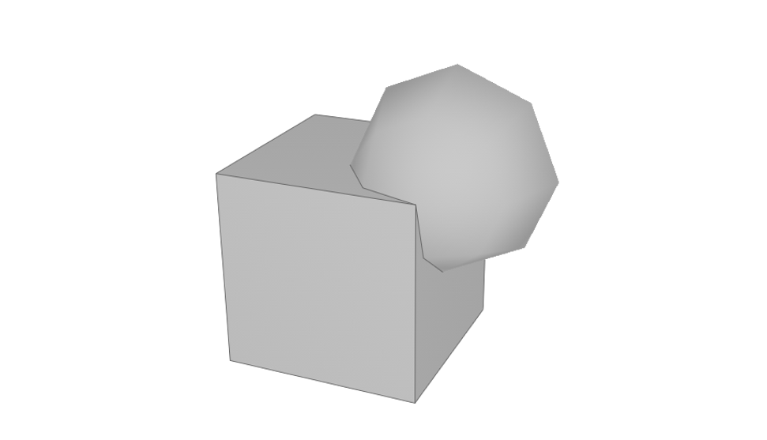

* Булевое вычитание

.. lua:function:: Subtract(solid1, solid2)

    :param solid1: Задает первый операнд операции
    :type solid1: Solid
    :param solid2: Задает второй операнд операции
    :type solid2: Solid
    :return: Твердотельная 3D-геометрия.
    :rtype: Solid

Пример кода:

.. code-block:: lua
    :caption: Пример 13.
    :linenos:

    local detailedGeometry = ModelGeometry()
    local cube = CreateBlock(20, 20, 20)
    local sphere = CreateSphere(10)
    local compoundSolid = Subtract(cube, sphere:Shift(10, 0, 20)):ShowTangentEdges(false)
    detailedGeometry:AddSolid(compoundSolid)
    Style.SetDetailedGeometry(detailedGeometry)

Результат:

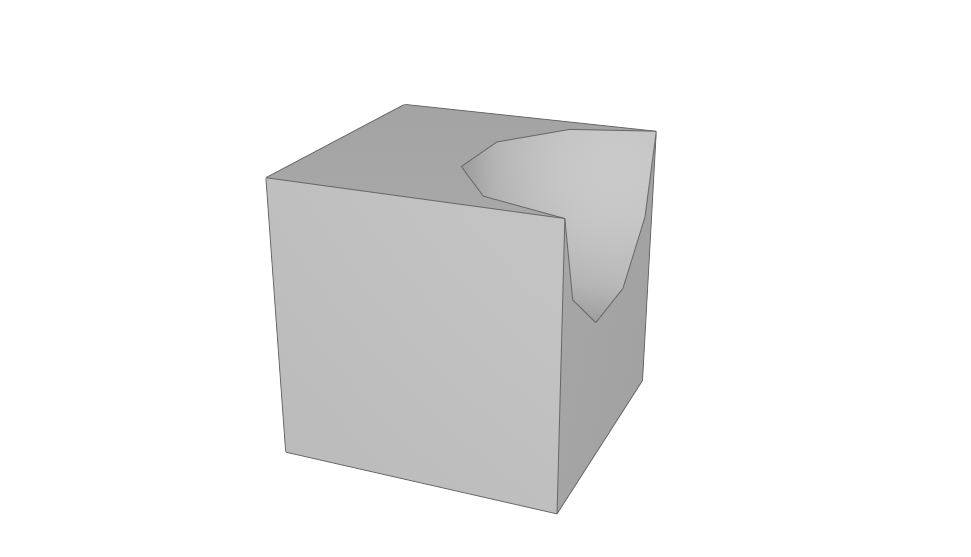

* Булевое пересечение

.. lua:function:: Intersect(solid1, solid2)

    :param solid1: Задает первый операнд операции
    :type solid1: Solid
    :param solid2: Задает второй операнд операции
    :type solid2: Solid
    :return: Твердотельная 3D-геометрия.
    :rtype: Solid

Пример кода:

.. code-block:: lua
    :caption: Пример 13.
    :linenos:

    local detailedGeometry = ModelGeometry()
    local cube = CreateBlock(20, 20, 20)
    local sphere = CreateSphere(10)
    local compoundSolid = Intersect(cube, sphere:Shift(10, 0, 20)):ShowTangentEdges(false)
    detailedGeometry:AddSolid(compoundSolid)
    Style.SetDetailedGeometry(detailedGeometry)

Результат:

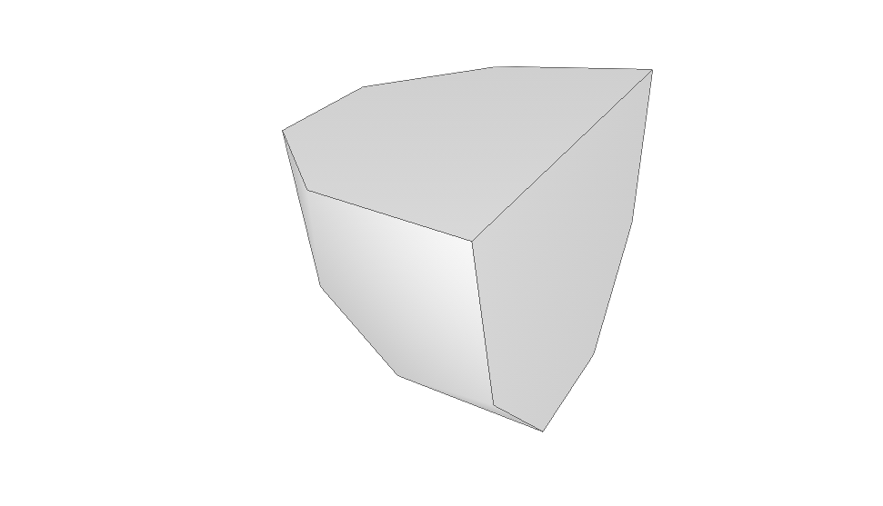