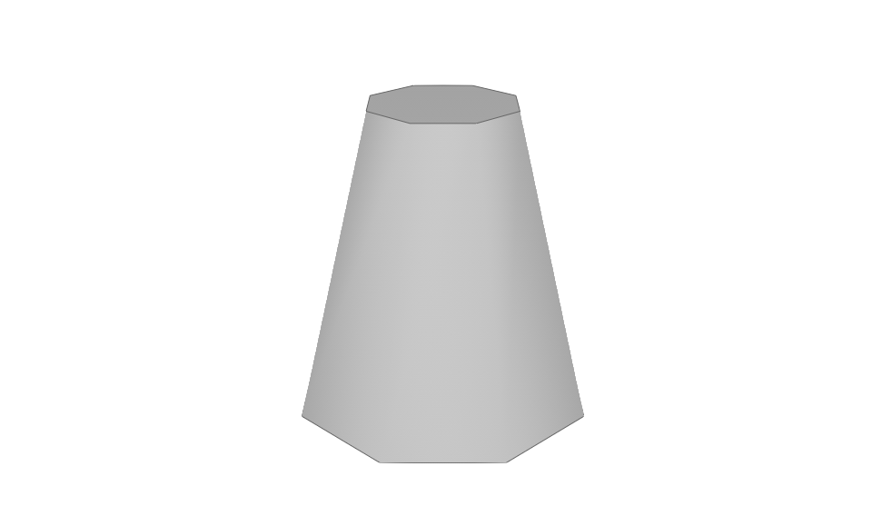

Твердотельная 3D-геометрия (класс Solid)
========================================

Общий класс **Solid** не имеет конструктора. Содержит функции, порождающие твердотельную геометрию. Служит для построения 3D-геометрии оборудования.

Порождающие функции
-------------------

Куб
^^^

Правильный многогранник, каждая грань которого представляет собой квадрат.

.. function:: Cube(size)

    :param size: Задает размер грани куба.
    :type size: Number
    :return: Твердотельная геометрия.
    :rtype: Solid

.. code-block:: lua
    :caption: Пример кода:
    :linenos:

    local solid = Cube(20)
    renga.geometry.detailed.add_solid(solid)

Результат:

.. image:: _static/Cube.png
    :height: 230 px
    :width: 400 px
    :align: center

Параллелепипед
^^^^^^^^^^^^^^

Четырехугольная призма, все грани которой являются прямоугольниками (прямоугольный параллелепипед).

.. function:: Box(length, width, height)

    :param length: Задает длину параллелепипеда.
    :type length: Number
    :param width: Задает глубину параллелепипеда.
    :type width: Number
    :param height: Задает высоту параллелепипеда.
    :type height: Number
    :return: Твердотельная геометрия.
    :rtype: Solid

.. code-block:: lua
    :caption: Пример кода:
    :linenos:

    local solid = Box(40, 15, 20)
    renga.geometry.detailed.add_solid(solid)

Результат:

.. image:: _static/Box.png
    :height: 230 px
    :width: 400 px
    :align: center

Сфера
^^^^^

.. function:: Sphere(radius)

    :param radius: Задает радиус сферы.
    :type radius: Number
    :return: Твердотельная геометрия.
    :rtype: Solid

.. code-block:: lua
    :caption: Пример кода:
    :linenos:

    local solid = Sphere(10)
    renga.geometry.detailed.add_solid(solid:hide_smooth_edges())

Результат:

.. image:: _static/Sphere.png
    :height: 230 px
    :width: 400 px
    :align: center

Цилиндр
^^^^^^^

Тело, ограниченное цилиндрической поверхностью и двумя параллельными плоскостями, пересекающими её.

.. function:: Cylinder(radius, height)

    :param radius: Задает радиус цилиндра.
    :type radius: Number
    :param height: Задает высоту цилиндра.
    :type height: Number
    :return: Твердотельная геометрия.
    :rtype: Solid

.. code-block:: lua
    :caption: Пример кода:
    :linenos:

    local solid = Cylinder(10, 40)
    renga.geometry.detailed.add_solid(solid:hide_smooth_edges())

Результат:

.. image:: _static/Cylinder.png
    :height: 230 px
    :width: 400 px
    :align: center

Конус
^^^^^

Прямой конус, основанием которого является окружность и ортогональная проекция вершины конуса на плоскость основания совпадает с этим центром.

.. function:: Cone(radius, height)

    :param radius: Задает радиус конуса.
    :type radius: Number
    :param height: Задает высоту конуса.
    :type height: Number
    :return: Твердотельная геометрия.
    :rtype: Solid

.. code-block:: lua
    :caption: Пример кода:
    :linenos:

    local solid = Cone(10, 40)
    renga.geometry.detailed.add_solid(solid:hide_smooth_edges())

Результат:

.. image:: _static/Cone.png
    :height: 230 px
    :width: 400 px
    :align: center

Усеченный конус
^^^^^^^^^^^^^^^

Часть конуса, лежащая между основанием и плоскостью, параллельной основанию и находящейся между вершиной и основанием.

.. function:: ConicalFrustum(bottom_radius, top_radius, height)

    :param bottom_radius: Задает радиус основания усеченного конуса.
    :type bottom_radius: Number
    :param top_radius: Задает радиус верха усеченного конуса.
    :type top_radius: Number    
    :param height: Задает высоту усеченного конуса.
    :type height: Number
    :return: Твердотельная геометрия.
    :rtype: Solid

.. code-block:: lua
    :caption: Пример кода:
    :linenos:

    local solid = ConicalFrustum(10, 5, 20)
    renga.geometry.detailed.add_solid(solid:hide_smooth_edges())

Результат:

Пирамида с прямоугольным основанием
^^^^^^^^^^^^^^^^^^^^^^^^^^^^^^^^^^^

Основанием пирамиды является прямоугольник.

.. function:: Pyramid(size_x, size_y, height)

    :param size_x: Задает размер основания пирамиды по оси X.
    :type size_x: Number
    :param size_y: Задает размер основания пирамиды по оси Y.
    :type size_y: Number    
    :param height: Задает высоту пирамиды.
    :type height: Number
    :return: Твердотельная геометрия.
    :rtype: Solid

.. code-block:: lua
    :caption: Пример кода:
    :linenos:

    local solid = Pyramid(25, 15, 20)
    renga.geometry.detailed.add_solid(solid)

Результат:

.. image:: _static/Pyramid.png
    :height: 230 px
    :width: 400 px
    :align: center

Тело выдавливания
^^^^^^^^^^^^^^^^^

.. function:: Extrusion(contour, height)

    :param contour: Задает плоский контур выдавливания.
    :type contour: :ref:`Curve2d <curve2d>`   
    :param height: Задает высоту тела выдавливания.
    :type height: Number
    :return: Твердотельная геометрия.
    :rtype: Solid

.. code-block:: lua
    :caption: Пример кода:
    :linenos:

    local points = {
        Point2d(0, 0),
        Point2d(0, 10),
        Point2d(10, 10),
        Point2d(10, 8),
        Point2d(8, 8),
        Point2d(8, 6),
        Point2d(6, 6),
        Point2d(6, 4),
        Point2d(4, 4),
        Point2d(4, 2),
        Point2d(2, 2),
        Point2d(2, 0)}
    local contour = ClosedContourByPoints(points)
    local solid = Extrusion(contour, 40)
    renga.geometry.detailed.add_solid(solid)

Результат:

.. image:: _static/Extrusion.png
    :height: 230 px
    :width: 400 px
    :align: center

Тело выдавливания с толщиной
^^^^^^^^^^^^^^^^^^^^^^^^^^^^

.. function:: ExtrusionWithThickness(contour, height, thickness)

    :param contour: Задает плоский контур выдавливания.
    :type contour: :ref:`Curve2d <curve2d>`   
    :param height: Задает высоту тела выдавливания.
    :type height: Number
    :param thickness: Задает толщину контура выдавливания.
    :type thickness: Number
    :return: Твердотельная геометрия.
    :rtype: Solid

.. code-block:: lua
    :caption: Пример кода:
    :linenos:

    local points = {
        Point2d(0, 0),
        Point2d(0, 10),
        Point2d(10, 10),
        Point2d(10, 8),
        Point2d(8, 8),
        Point2d(8, 6),
        Point2d(6, 6),
        Point2d(6, 4),
        Point2d(4, 4),
        Point2d(4, 2),
        Point2d(2, 2),
        Point2d(2, 0)}
    local contour = ClosedContourByPoints(points)
    local solid = ExtrusionWithThickness(contour, 15, 0.5)
    renga.geometry.detailed.add_solid(solid)

Результат:

.. image:: _static/ExtrusionWithThickness.png
    :height: 230 px
    :width: 400 px
    :align: center

Построение тела по плоским сечениям
^^^^^^^^^^^^^^^^^^^^^^^^^^^^^^^^^^^

.. function:: CreateLoftedSolid({profiles}, {placements})

    :param {profiles}: Задает таблицу плоских контуров.
    :type {profiles}: table of :ref:`Curves2d <curve2d>`   
    :param {placements}: Задает таблицу координатных плоскостей в 3D пространстве.
    :type {placements}: table of :ref:`Placements3d <placement3d>`
    :return: Твердотельная геометрия.
    :rtype: Solid

.. code-block:: lua
    :caption: Пример кода:
    :linenos:

    local profiles = {
        Rectangle(30, 30),
        Circle(Point2d(0, 0), 10)}
    local placements = {
        Placement3d(Point3d(0, 0, 0),
                    Vector3d(1, 0, 0),
                    Vector3d(0, 1, 0)),
        Placement3d(Point3d(40, 0, 0),
                    Vector3d(1, 0, 0),
                    Vector3d(0, 1, 0))}
    local solid = CreateLoftedSolid(profiles, placements)
    renga.geometry.detailed.add_solid(solid:hide_smooth_edges())

Результат:

.. image:: _static/CreateLoftedSolid.png
    :height: 230 px
    :width: 400 px
    :align: center

Построение кинематического тела путем движения образующей кривой вдоль направляющей кривой
^^^^^^^^^^^^^^^^^^^^^^^^^^^^^^^^^^^^^^^^^^^^^^^^^^^^^^^^^^^^^^^^^^^^^^^^^^^^^^^^^^^^^^^^^^

.. function:: CreateLoftedSolidByProfilesAndPath(start_profile, end_profile, path)

    :param start_profile: Задает плоский контур в начале.
    :type start_profile: :ref:`Curve2d <curve2d>`   
    :param end_profile: Задает плоский контур в конце.
    :type end_profile: :ref:`Curve2d <curve2d>`
    :param path: Задает путь движения в виде трехмерной кривой.
    :type path: :ref:`Curve3d <curve3d>`
    :return: Твердотельная геометрия.
    :rtype: Solid

.. code-block:: lua
    :caption: Пример кода:
    :linenos:

    local start_profile = Rectangle(30, 30)
    local end_profile = Circle(Point2d(0, 0), 10)
    local arc_2d = ArcByCenter(Point2d(0, 0),
                               Point2d(-30, 0),
                               Point2d(0, 30),
                               true)
    local arc_3d = Curve3dByCurveAndPlacement(arc_2d,
                                              Placement3d(Point3d(0, 0, 0),
                                                          Vector3d(0, -1, 0),
                                                          Vector3d(0, 0, 1)))
    local solid = CreateLoftedSolidByProfilesAndPath(start_profile, end_profile, arc_3d)
    renga.geometry.detailed.add_solid(solid:hide_smooth_edges())

Результат:

.. image:: _static/CreateLoftedSolidByProfilesAndPath.png
    :height: 230 px
    :width: 400 px
    :align: center

Тело вращения
^^^^^^^^^^^^^

Вращение плоского замкнутого контура вокруг заданной оси на указанный угол.

.. function:: Revolution(placement, contour, origin, axis, counterClockwiseAngle, ClockwiseAngle)

    :param placement: Задает координатную плоскость.
    :type placement: :ref:`Placement3d <placement3d>`
    :param contour: Задает плоский контур.
    :type contour: :ref:`Curve2d <curve2d>`
    :param origin: Задает точку начала оси вращения.
    :type origin: :ref:`Point3d <point3d>`
    :param axis: Задает ориентацию (вектор) оси вращения.
    :type axis: :ref:`Vector3d <vector3d>`
    :param counterClockwiseAngle: Задает угол вращения против часовой стрелки.
    :type counterClockwiseAngle: Number
    :param ClockwiseAngle: Задает угол вращения по часовой стрелке.
    :type ClockwiseAngle: Number

.. code-block:: lua
    :caption: Пример кода:
    :linenos:

    local placement = Placement3d(Point3d(0, 0, 0),
                                  Vector3d(1, 0, 0),
                                  Vector3d(0, 1, 0))
    local contour = Rectangle(6, 15):fillet_nth(3, 3):fillet_nth(5, 3)
    local solid = Revolution(placement,
                             contour,
                             Point3d(0, 10, 0),
                             Vector3d(0, -0.5, 1),
                             0,
                             270)
    renga.geometry.detailed.add_solid(solid:hide_smooth_edges())

Результат:

.. image:: _static/Revolution.png
    :height: 230 px
    :width: 400 px
    :align: center

Методы класса
-------------

Общие методы твердотельной геометрии Solid.

* Сместить по осям X, Y, Z

.. function:: :shift(d_x, d_y, d_z)

    :param d_x: Задает смещение по оси X.
    :type d_x: Number
    :param d_y: Задает смещение по оси Y.
    :type d_y: Number
    :param d_z: Задает смещение по оси Z.
    :type d_z: Number

* Повернуть относительно оси

.. function:: :rotate(axis, angle)

    :param axis: Задает ось вращения.
    :type axis: :ref:`Axis <axis>`
    :param angle: Задает угол поворота.
    :type angle: Number

* Разместить в относительной системе координат

.. function:: :place(placement)

    :param placement: Задает координатную систему в 3D пространстве.
    :type placement: :ref:`Placement3d <placement3d>`

* Скрытие ребер

.. function:: :hide_smooth_edges()

Операторы
---------

* Булевое сложение

.. function:: +

Пример кода:

.. code-block:: console

    local cube = Cube(20)
    local sphere = Sphere(10)
    renga.geometry.detailed.add_solid(
        cube + sphere:shift(10, 0, 10):hide_smooth_edges())

Результат:

.. image:: _static/Add_3D.png
    :height: 230 px
    :width: 400 px
    :align: center

* Булевое вычитание

.. function:: -

Пример кода:

.. code-block:: console

    local cube = Cube(20)
    local sphere = Sphere(10)
    renga.geometry.detailed.add_solid(
        cube - sphere:shift(10, 0, 10):hide_smooth_edges())

Результат:

.. image:: _static/Sub_3D.png
    :height: 230 px
    :width: 400 px
    :align: center
