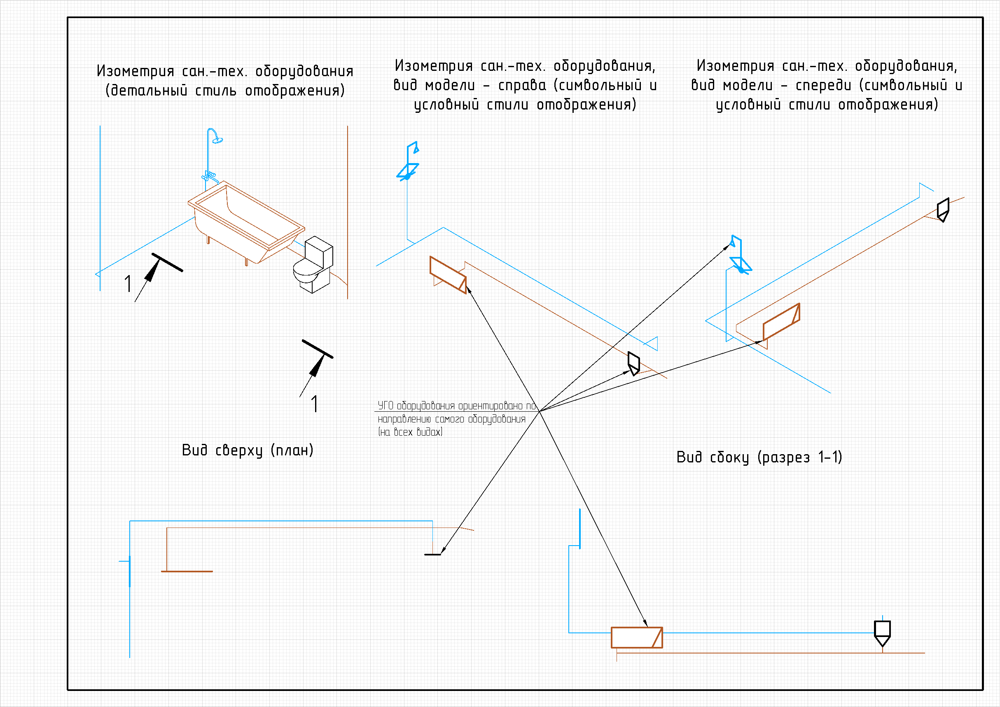
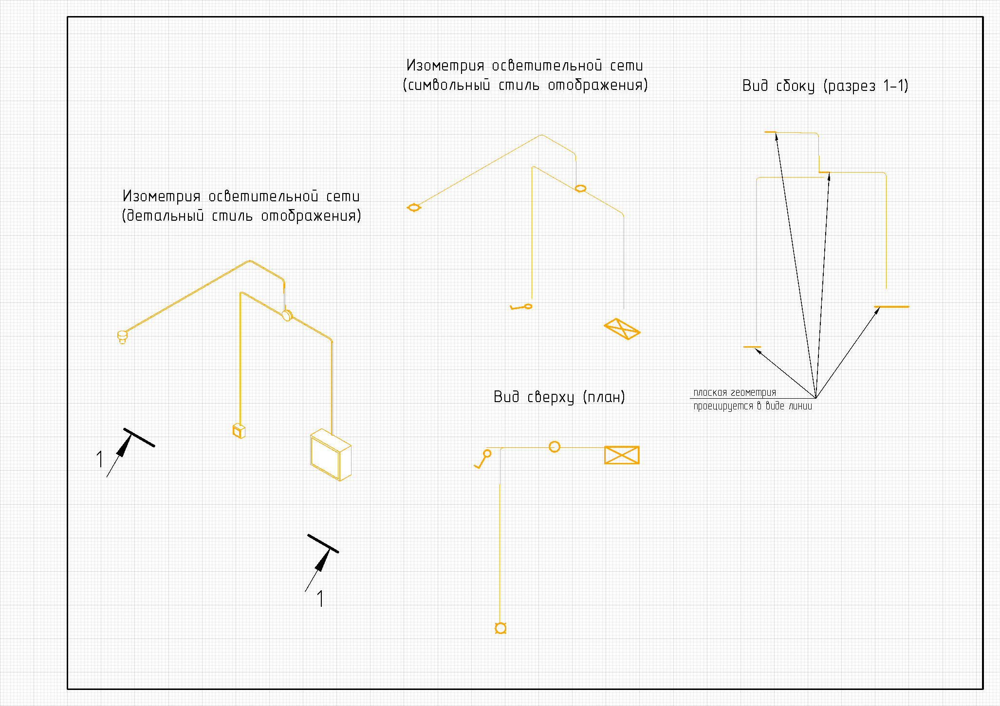

Плоская геометрия
=================

Служит для создания условного или символьного графического отображения различного оборудования. В зависимости от нужного поведения на видах (планах, разрезах, аксонометрических видах) различают несколько видов плоской геометрии (см. **Производные функции**).
Плоская геометрия является контейнером, вмещающим в себя графические примитивы (из которых будет состоять УГО) таких типов, как:

* :ref:`Двумерные кривые <curve2d>`
* :ref:`Двумерные регионы <region>`

Пример кода:

.. code-block:: console

    local geometry = PlanarGeometryPlane()

    geometry:add_curve(Rectangle(20, 10))
    geometry:add_curve(Line(Point2d(10, -5),
                            Point2d(-10, 5)))
    geometry:add_hatch_basic(Region({ClosedContourByPoints({Point2d(10, -5),
                                                            Point2d(-10, 5),
                                                            Point2d(-10, -5)})}))

    renga.geometry.symbol.add_planar_geometry(geometry:set_unscalable(true))

Результат:

.. image:: _static/PlanarGeometry.png
    :scale: 50 %

Производные функции
-------------------

Плоская геометрия, ориентированная по направлению осей
^^^^^^^^^^^^^^^^^^^^^^^^^^^^^^^^^^^^^^^^^^^^^^^^^^^^^^

Наследует положение объекта и направление осей. Статична и всегда повёрнута в одну сторону, которую задаёт метод ``set_placement()``

.. note:: В основном используется в символьном и условном отображении оборудования

Конструктор:

.. function:: PlanarGeometryPlane()

Пример поведения:

Плоская геометрия, ориентированная по направлению оси X, угол поворота кратен 90 градусам
^^^^^^^^^^^^^^^^^^^^^^^^^^^^^^^^^^^^^^^^^^^^^^^^^^^^^^^^^^^^^^^^^^^^^^^^^^^^^^^^^^^^^^^^^

Наследует положение объекта и направление оси X. Ось Z направлена в сторону камеры, если это возможно. Угол поворота кратен 90 градусам.

.. note:: В основном используется в символьном и условном отображении аксессуаров трубопроводов и воздуховодов

Конструктор:

.. function:: PlanarGeometryAxis90()

Пример поведения:

.. image:: _static/PlanarGeometryAxis90.png

Плоская геометрия, ориентированная по направлению глобальной оси Z
^^^^^^^^^^^^^^^^^^^^^^^^^^^^^^^^^^^^^^^^^^^^^^^^^^^^^^^^^^^^^^^^^^

Наследует положение объекта. Нормаль ориентирована в сторону глобальной оси Z.

Плоская геометрия, которая ориентирована только вверх (ось Z) ЛСК проекта. Т.е. видна только на проекциях сверху (планах), при проецировании сбоку (разрез) вырождается в линию.

.. note:: Используется для создания символьного отображения оборудования электрических систем

Конструктор:

.. function:: PlanarGeometryGlobalZ()

Пример поведения:

Плоская геометрия, ориентированная по направлению оси X
^^^^^^^^^^^^^^^^^^^^^^^^^^^^^^^^^^^^^^^^^^^^^^^^^^^^^^^

Наследует положение объекта и направление оси X. Ось Z направлена в сторону камеры, если это возможно.

.. attention:: Не используется

Конструктор:

.. function:: PlanarGeometryAxis()

Плоская геометрия, ориентированная по виду
^^^^^^^^^^^^^^^^^^^^^^^^^^^^^^^^^^^^^^^^^^

Наследует положение объекта. Ориентирована в сторону взгляда.

.. attention:: Не используется

Конструктор:

.. function:: PlanarGeometryOrientedToView()

Методы
------

Общие методы плоской геометрии.

* Сместить по осям X, Y

.. function:: :shift(d_x, d_y)

    :param d_x: Задает смещение по оси X.
    :type d_x: number
    :param d_y: Задает смещение по оси Y.
    :type d_y: number

* Повернуть относительно точки

.. function:: :rotate(point, angle)

    :param point: Задает точку-центр вращения.
    :type point: :ref:`Point2d <point2d>`
    :param angle: Задает угол поворота.
    :type angle: number

* Масштабировать по двум осям относительно указанной точки

.. function:: :scale(point, x_scale, y_scale)

    :param point: Задает точку, относительно которой будет масштабироваться кривая.
    :type point: :ref:`Point2d <point2d>`
    :param x_scale: Задает коэффициент масштабирования по оси X.
    :type x_scale: number
    :param y_scale: Задает коэффициент масштабирования по оси Y.
    :type y_scale: number

* Добавить кривую к плоской геометрии

.. function:: :add_curve(curve)

    :param curve: Задает двухмерную кривую.
    :type curve: :ref:`Curve2d <curve2d>`

* Добавить регион к основной штриховке

.. function:: :add_hatch_basic(region)

    :param region: Задает двухмерный регион.
    :type region: :ref:`Region <region>`

* Добавить регион к дополнительной штриховке

.. function:: :add_hatch_extra(region)

    :param region: Задает двухмерный регион.
    :type region: :ref:`Region <region>`

* Задать ЛСК для построения плоской геометрии

.. function:: :set_placement(placement)

    :param placement: Задает трёхмерную локальную систему координат.
    :type placement: :ref:`Placement3d <placement3d>`

* Задать возможность масштабирования геометрии

.. function:: :set_unscalable(bool)

    :param bool: True - геометрия не масштабируется. False - масштабируется.
    :type bool: boolean

* Задать приоритет геометрии по оси Z

.. function:: :set_z_index_priority(bool)

    :param bool: True - приоритет задан. False - не задан.
    :type bool: boolean