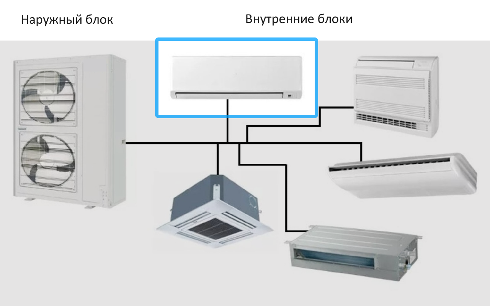
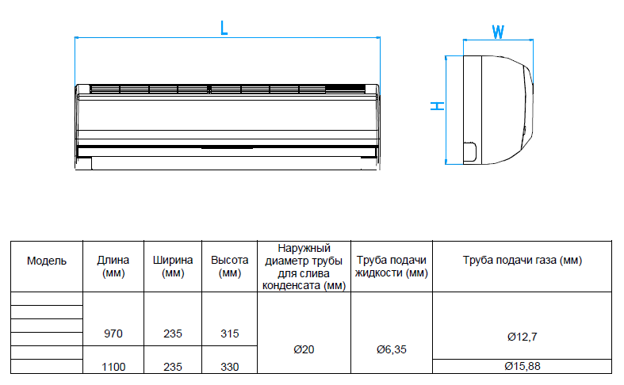
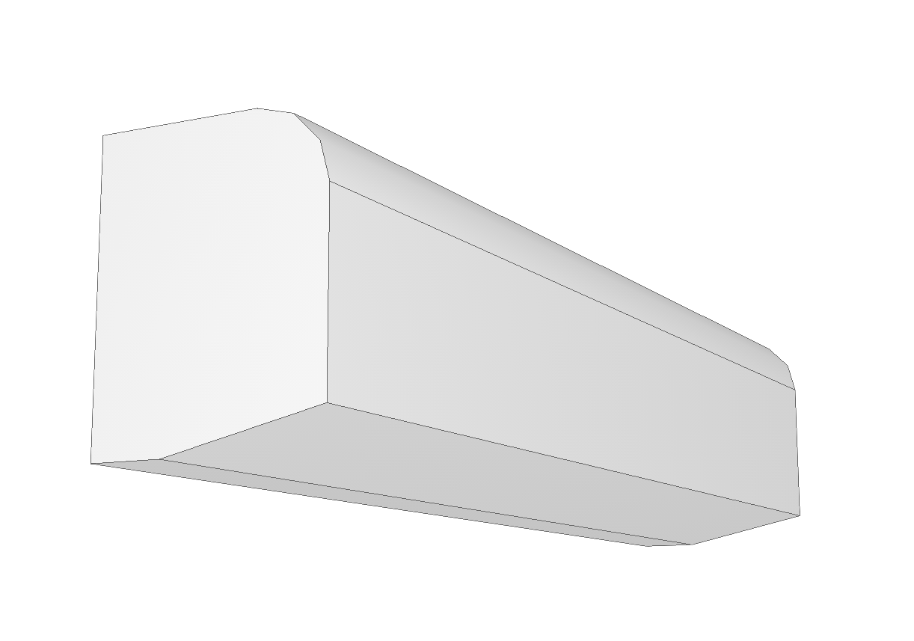
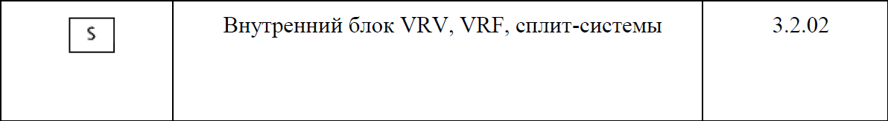

Вводные данные
==============

.. important:: Данное обучающее руководство рассчитано на специалистов, имеющих навыки программирования и способных самостоятельно сконфигурировать рабочие инструменты для создания шаблона.

Чтобы лучше понять, как создается шаблон пользовательской категории Renga, предлагаем вам пройти данное обучающее руководство, в котором пошагово описан каждый аспект создания пользовательского оборудования.

Для создания данного примера было использовано следующее бесплатное программное обеспечение:

- Текстовый редактор `Visual Studio Code <https://code.visualstudio.com/>`_ для создания файлов описания параметров и STDL-скриптов;

Импорт подготовленного шаблона стиля оборудования, скомпилированного в файл ``*.rst``, возможен в `Renga Professional <https://rengabim.com/>`_ версии 7.0 (и старше).

.. note:: Иллюстрации взяты из открытых интернет-источников, без привязки к конкретному производителю.

Описание оборудования
---------------------

Область применения
""""""""""""""""""

Категория инженерной системы: **Кондиционирование**

Мультизональные системы кондиционирования VRF относятся к промышленному типу оборудования и применяются преимущественно в крупных многоэтажных зданиях разного назначения. Оно включает в себя различное оборудование, для внутренней и для внешней установки.
Мы создадим шаблон очень распространенной категории оборудования — **Внутреннего настенного блока VRF-системы**.

    Оборудование VRF-систем

Форма оборудования
""""""""""""""""""

    Схематический чертеж настенного блока VRF-системы

Оборудование имеет простую форму. Условно его можно представить в виде параллелепипеда, но для "узнаваемости" создадим его в виде такой формы:

    3D-модель настенного блока VRF-системы в Renga

.. note:: Не рекомендуется создавать излишне детализированные 3D-модели оборудования. Чем большую детализацию имеет 3D-модель, тем больше ресурсов компьютера она требует для расчета геометрии и отрисовки. Это становится особенно важным при работе в проектах с большим количеством объектов. Для удобной работы в большинстве случаев достаточно моделировать простыми формами (параллелепипед, цилиндр и т.д.).

Точки подключения
"""""""""""""""""

Для подключения оборудования к инженерным системам добавим следующие порты:

1. Подключение трубы подачи жидкости (трубопроводная система).
2. Подключение трубы подачи газа (трубопроводная система).
3. Подключение трубы для слива конденсата (трубопроводная система).
4. Подключение линии электрического питания высокого напряжения (электрическая система).
5. Подключение линии управления/связи (электрическая система).
6. Подключение линии от проводного пульта управления (электрическая система).

Условно-графическое обозначение
"""""""""""""""""""""""""""""""
Выполним условное графическое обозначение по стандарту АВОК СТО НП "АВОК" 1.05-2006, табл. 3.2, код 3.2.02.

    Условное графическое обозначение внутреннего блока VRF-системы

Размеры обозначения на видах примем (для условного отображения) равными габаритному размеру оборудования.