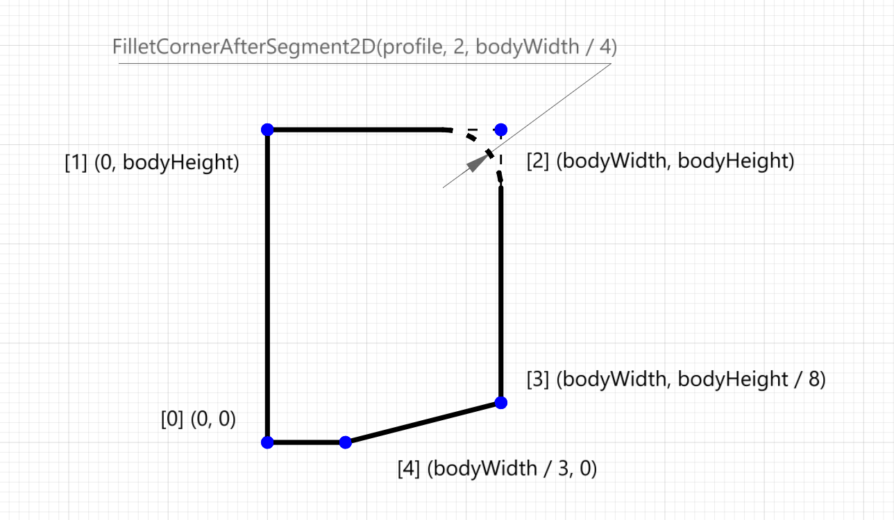
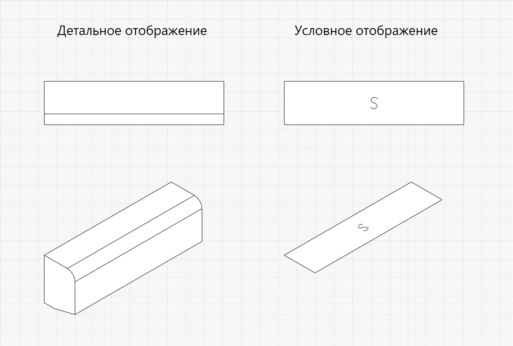
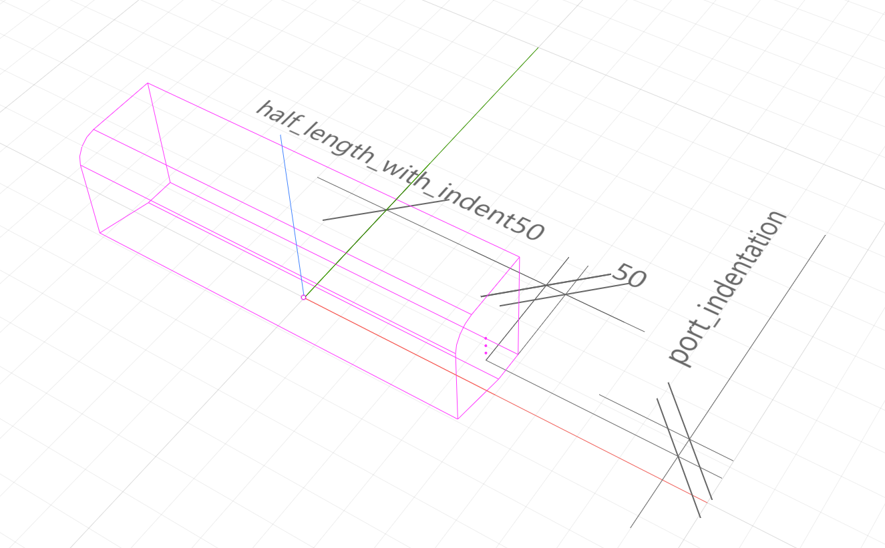
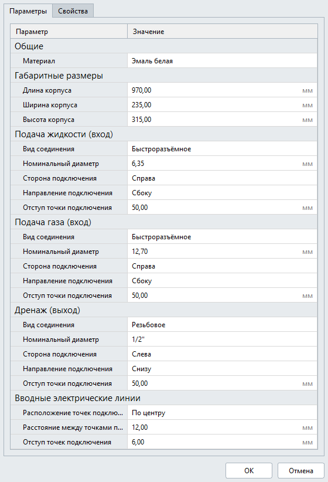

STDL-скрипт
============

Перейдём к описанию динамической части описания шаблонной категории. Это создание скрипта на языке Lua, создающий на основе параметров из ``parameters.json`` категорию объекта 

Создание детальной 3D-геометрии
-------------------------------

1. Создадим экземпляр класса ``ModelGeometry``, в котором будем "собирать" детальный уровень детализации. Кроме того объявим несколько локальных переменных, которые помогут проще писать скрипт.

.. code-block:: lua
    :caption: Объявление локальных переменных.
    :linenos:

    -- создание экземпляра ModelGeometry
    local detailedGeometry = ModelGeometry()

    -- объявление локальных переменных
    local parameters = Style.GetParameterValues()

    local height = parameters.Dimensions.bodyHeight
    local width = parameters.Dimensions.bodyWidth
    local length = parameters.Dimensions.bodyLength

Корпус настенного блока VRF-системы будет создан телом выдавливания :ref:`Extrude <extrusion>`.

2. Создадим функцию ``makeProfile()``, которая будет создавать пятиугольник по точкам — замкнутый контур :ref:`CreatePolyline2D <closed_contour>`. Координаты точек будут определяться параметрами ``height`` и ``width``:

.. code-block:: lua
    :caption: Функция ``makeProfile()``, создающая профиль корпуса оборудования.
    :linenos:

    local function makeProfile()
        local points = {
            Point2D(0, 0),
            Point2D(0, height),
            Point2D(width, height),
            Point2D(width, height / 8),
            Point2D(width / 3, 0),
            Point2D(0, 0)}
        local profile = CreatePolyline2D(points)
        FilletCornerAfterSegment2D(profile, 2, width / 4)
        return profile
    end

Метод ``FilletCornerAfterSegment2D`` скругляет вершину отрезка с индексом [2] и следующего отрезка по радиусу, равным ``width`` / 4.

    Профиль корпуса оборудования

3. Далее создадим тело выдавливания :ref:`Extrude <extrusion>` на длину ``length``, разместим его в своей локальной системе координат ``vrfPlacement`` и добавим полученное тело в модельную геометрию ``detailedGeometry`` с помощью метода ``AddSolid``.

.. code-block:: lua
    :caption: Добавление тела в модельную геометрию ``detailedGeometry``.
    :linenos:

    -- задание ЛСК
    local vrfPlacement = Placement3D(Point3D(0, 0, 0),
                                    Vector3D(-1, 0, 0),
                                    Vector3D(0, -1, 0))

    -- дополнительные параметры для функции Extrude()
    local extrusionParams = ExtrusionParameters(length)

    -- создание твердотельной 3D-геометрии
    local vrfSolid = Extrude(makeProfile(), extrusionParams, vrfPlacement)
        :Shift(length / 2, width / 2, 0)

    -- добавление твердотельной 3D-геометрии в детальную геометрию
    detailedGeometry:AddSolid(vrfSolid)

.. note:: Центр геометрического примитива создается в начале координат своей ЛСК.
    
По умолчанию выдавливание профиля выполняется относительно оси Z, т.е. вертикально. С помощью параметра ``vrfPlacement`` мы задаем новую ЛСК, в которой тело ориентируется горизонально (поворачиваем оси).

4. Для создания детальной геометрии стиля, передадим модельную геометрию ``detailedGeometry`` в качестве аргумента функции SetDetailedGeometry.

.. code-block:: lua
    :caption: Создание детальной геометрии стиля.
    :linenos:

    -- создание детальной геометрии стиля
    Style.SetDetailedGeometry(detailedGeometry)

Создание условного изображения
------------------------------

5. В начале создадим экземпляр класса ModelGeometry, в котором будем "собирать" условную геометрию стиля, а также несколько примитивов из двумерных кривых: ``contour`` — для создания прямоугольного контура оборудования и ``letterS`` — для создания буквы "S".

.. code-block:: lua
    :caption: Создание плоских кривых ``contour`` и ``letterS``.
    :linenos:

    -- создание экземпляра ModelGeometry
    local symbolicGeometry = ModelGeometry()

    -- создание двумерных кривых для двумерной геометрии
    local contour = CreateRectangle2D(Point2D(0, 0), 0, length, width)
    local letterS = CreateCompositeCurve2D({
                        CreateArc2DByThreePoints(Point2D(19.4, 23), Point2D(4.2, 30.4), Point2D(-12, 26)),
                        CreateArc2DByThreePoints(Point2D(-12, 26), Point2D(-16.4, 14.2), Point2D(-9, 4.2)),
                        CreateLineSegment2D(Point2D(-9, 4.2), Point2D(9, -4.2)),
                        CreateArc2DByThreePoints(Point2D(9, -4.2), Point2D(16.4, -14.2), Point2D(12, -26)),
                        CreateArc2DByThreePoints(Point2D(12, -26), Point2D(-4.2, -30.4), Point2D(-19.4, -23))})

Составная кривая ``letterS`` создается из 5-ти отдельных односегментных кривых, путем объединения в функции ``CreateCompositeCurve2D()``.

6. Условное изображение категории будет двумерной геометрией. Поместим созданные кривые в двумерную геометрию с помощью метода ``AddCurves`` и добавим основную заливку с помощью метода ``AddMaterialColorSolidArea``.

.. code-block:: lua
    :caption: Создание двумерной геометрии.
    :linenos:

    -- создание экземпляра двумерной геометрии
    local geometry = GeometrySet2D()

    -- задание ЛСК
    local geometryPlacement = Placement3D(Point3D(0, 0, height), Vector3D(0, 0, 1), Vector3D(1, 0, 0))

    -- добавление кривых и области заливки в двумерную геометрию
    geometry:AddCurve(contour):AddCurve(letterS)
    geometry:AddMaterialColorSolidArea(FillArea(contour))

    -- добавление двумерной геометрии в модельную геометрию
    symbolicGeometry:AddGeometrySet2D(geometry, geometryPlacement)

Cозданную двумерную геометрию ``geometry`` добавляем в модельную геометрию ``symbolicGeometry`` с помощью метода ``AddGeometrySet2D``.

7. Для создания условной геометрии стиля, передадим модельную геометрию ``symbolicGeometry`` в качестве аргумента функции SetSymbolicGeometry.

.. code-block:: lua
    :caption: Создание условной геометрии стиля.
    :linenos:

    -- создание условной геометрии стиля
    Style.SetSymbolicGeometry(symbolicGeometry)

    Детальное и условное отображение

Создание портов
---------------

Создание портов трубопроводных систем
"""""""""""""""""""""""""""""""""""""

8. Объявим несколько локальных переменных, которые помогут создать декартовы точки портов.

.. note:: Порты размещаются по-умолчанию в центре ЛСК

.. code-block:: lua
    :caption: Объявление локальных переменных.
    :linenos:

    -- объявление локальных переменных
    local halfWidth = width / 2
    local halfLengthWithIndent50 = length / 2 - 50
    local waterPortIntendation = parameters.WaterCoolant.portIndentation
    local gasPortIntendation = parameters.GasCoolant.portIndentation
    local drainagePortIntendation = parameters.Drainage.portIndentation

    -- декартовы точки по-умолчанию
    local waterCoolantOrigin = Point3D(0, 0, 0)
    local gasCoolantOrigin = Point3D(0, 0, 0)
    local drainageOrigin = Point3D(0, 0, 0)

9. Следующая часть кода размещает декартовы точки портов в зависимости от параметра ``connectionSide``: слева или справа относительно центра корпуса оборудования. Координату X определяет переменная ``halfLengthWithIndent50``, координата Y высчитывается с учетом параметра отступа ``portIndentation``, а координаты Z — фиксированы (25, 50 и 75).

.. code-block:: lua
    :caption: Размещение декартовых точек портов с учетом параметра ``connectionSide``.
    :linenos:

    -- размещение декартовых точек портов с учетом параметра connectionSide
    if parameters.WaterCoolant.connectionSide == "right" then
        waterCoolantOrigin = Point3D(halfLengthWithIndent50,
                                    halfWidth - waterPortIntendation, 75)
    else
        waterCoolantOrigin = Point3D(-halfLengthWithIndent50,
                                    halfWidth - waterPortIntendation, 75)
    end

    if parameters.GasCoolant.connectionSide == "right" then
        gasCoolantOrigin = Point3D(halfLengthWithIndent50,
                                halfWidth - gasPortIntendation, 50)
    else
        gasCoolantOrigin = Point3D(-halfLengthWithIndent50,
                                    halfWidth - gasPortIntendation, 50)
    end

    if parameters.Drainage.connectionSide == "right" then
        drainageOrigin = Point3D(halfLengthWithIndent50,
                                halfWidth - drainagePortIntendation, 25)
    else
        drainageOrigin = Point3D(-halfLengthWithIndent50,
                                halfWidth - drainagePortIntendation, 25)
    end

    Размещение портов трубопроводных систем

10. Создадим функцию ``rotateVectors``, которая будет возвращать векторы осей Z и X в зависимости от параметра ``connectionDirection``, задающего направление подключения.

.. code-block:: lua
    :caption: Функция ``rotateVectors``.
    :linenos:

    -- создание функции rotateVectors, которая будет возвращать векторы осей Z и X в зависимости от параметра connectionDirection, задающего направление подключения.
    local function rotateVectors(name)
        local direction = parameters[name].connectionDirection
        local side = parameters[name].connectionSide

        -- векторы по-умолчанию
        local vectorZ = Vector3D(0, 0, 1)
        local vectorX = Vector3D(1, 0, 0)

        if direction == "side" then
            if side == "right" then
                vectorZ = Vector3D(1, 0, 0)
                vectorX = Vector3D(0, 1, 0)
            else
                vectorZ = Vector3D(-1, 0, 0)
                vectorX = Vector3D(0, 1, 0)
            end
        elseif direction == "back" then
            vectorZ = Vector3D(0, 1, 0)
            vectorX = Vector3D(1, 0, 0)
        else
            vectorZ = Vector3D(0, 0, -1)
            vectorX = Vector3D(1, 0, 0)
        end
        local vectors = {z = vectorZ, x = vectorX}
        return vectors
    end

11. Создадим функцию ``setPipeAttributes``, которая будет добавлять параметры соединения портам (см. главу :doc:`Порты </ports>`)

.. code-block:: lua
    :caption: Функция ``setPipeAttributes``.
    :linenos:

    -- создание функции setPipeAttributes, которая будет добавлять параметры соединения портам
    local function setPipeAttributes(port, portParameters)
        return parameters[portParameters].connectorType == PipeConnectorType.Thread
            and port:SetPipeParameters(parameters[portParameters].connectorType, parameters[portParameters].threadSize)
            or port:SetPipeParameters(parameters[portParameters].connectorType, parameters[portParameters].nominalDiameter)
    end

12. Разместим порты с помощью метода ``SetPlacement``. И далее добавим параметры портам с помощью созданной функции ``setPipeAttributes``.

.. code-block:: lua
    :caption: Размещение портов ``WaterCoolant``, ``GasCoolant`` и ``Drainage`` со своими параметрами.
    :linenos:

    -- размещение портов трубопроводных систем и добавление к ним параметров соединения
    Style.GetPort("WaterCoolant"):SetPlacement(Placement3D(waterCoolantOrigin,
                                                rotateVectors("WaterCoolant").z,
                                                rotateVectors("WaterCoolant").x))
    setPipeAttributes(Style.GetPort("WaterCoolant"), "WaterCoolant")

    Style.GetPort("GasCoolant"):SetPlacement(Placement3D(gasCoolantOrigin,
                                                rotateVectors("GasCoolant").z,
                                                rotateVectors("GasCoolant").x))
    setPipeAttributes(Style.GetPort("GasCoolant"), "GasCoolant")

    Style.GetPort("Drainage"):SetPlacement(Placement3D(drainageOrigin,
                                                rotateVectors("Drainage").z,
                                                rotateVectors("Drainage").x))
    setPipeAttributes(Style.GetPort("Drainage"), "Drainage")

Создание портов электрических систем
""""""""""""""""""""""""""""""""""""

13. Порты электрических систем будут размещаться группой на задней стенке VRF-блока. Направление портов будет фиксированным - назад (в стену). Атрибутов у электрических портов нет, поэтому достаточно только разместить их с учётом пользовательских параметров.

.. code-block:: lua
    :caption: Размещение портов электрических систем.
    :linenos:

    -- объявление локальных переменных
    local halfHeight = height / 2
    local direction = 1
    local electricPortIntendation = parameters.ElectricConnectors.portIndentation
    local distanceBetweenElectricPorts = parameters.ElectricConnectors.distanceBetweenPorts

    --декартова точка портов по-умолчанию
    local electricConnectorsOrigin = Point3D(-distanceBetweenElectricPorts,
                                            halfWidth - electricPortIntendation,
                                            halfHeight)

    -- изменение точки вставки портов в зависимости от параметра portLocation
    if parameters.ElectricConnectors.portLocation == "right" then
        electricConnectorsOrigin = Point3D(halfLengthWithIndent50,
                                            halfWidth - electricPortIntendation,
                                            halfHeight)
        direction = -1
    elseif parameters.ElectricConnectors.portLocation == "left" then
        electricConnectorsOrigin = Point3D(-halfLengthWithIndent50,
                                            halfWidth - electricPortIntendation,
                                            halfHeight)
    end

    -- размещение портов электрических систем
    Style.GetPort("PowerSupplyLine"):SetPlacement(Placement3D(
                                                    electricConnectorsOrigin,
                                                    Vector3D(0, 1, 0),
                                                    Vector3D(1, 0, 0)))
    Style.GetPort("ControlNetwork1"):SetPlacement(Placement3D(
                                                    electricConnectorsOrigin
                                                    :Shift(direction * distanceBetweenElectricPorts, 0, 0),
                                                    Vector3D(0, 1, 0),
                                                    Vector3D(1, 0, 0)))
    Style.GetPort("ControlNetwork2"):SetPlacement(Placement3D(
                                                    electricConnectorsOrigin
                                                    :Shift(direction * distanceBetweenElectricPorts, 0, 0),
                                                    Vector3D(0, 1, 0),
                                                    Vector3D(1, 0, 0)))

Настройка отображения параметров в диалоге стиля объекта
--------------------------------------------------------

14. Создадим функцию, которая в зависимости от выбранного вида соединения будет отображать в диалоге стиля объекта либо параметр ``nominalDiameter``, либо ``threadSize``. В теле функции мы вызываем метод ``SetVisible`` таблицы ``Style``. Вызовем эту функцию для групп параметров ``WaterCoolant``, ``GasCoolant`` и ``Drainage``.

.. code-block:: lua
    :caption: Функция ``hideIrrelevantPortParam``.
    :linenos:

    -- функция hideIrrelevantPortParam, которая в зависимости от выбранного вида соединения будет отображать в диалоге стиля объекта либо параметр nominalDiameter, либо threadSize.
    local function hideIrrelevantPortParam(portName)
        local param = parameters[portName].connectorType == PipeConnectorType.Thread
        and "nominalDiameter" or "threadSize"
        Style.GetParameter(portName, param):SetVisible(false)
    end

    hideIrrelevantPortParam("WaterCoolant")
    hideIrrelevantPortParam("GasCoolant")
    hideIrrelevantPortParam("Drainage")

.. note:: Если у группы скрыть все параметры, то она также автоматически будет скрыта.

И список параметров в диалоге стиля объекта будет теперь отображаться так:

    Параметры стиля объекта Renga (итог).